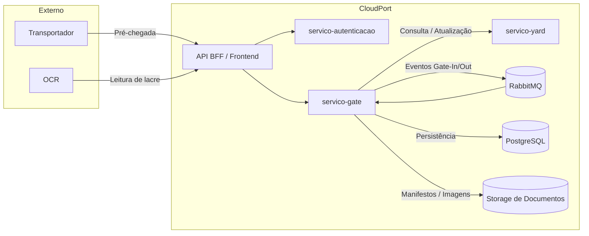
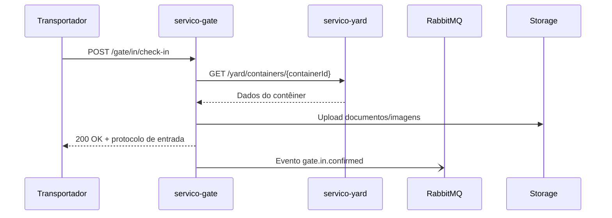
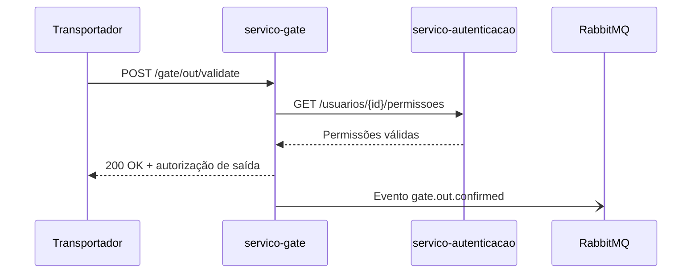

# CloudPort

CloudPort é um Terminal Operating System (TOS) modular construído sobre microsserviços Java e um front-end Angular. Este repositório concentra os principais serviços de autenticação, gate e gestão de pátio, além do material de apoio para operação da plataforma.

## Visão geral da arquitetura

O diagrama abaixo resume os blocos principais que suportam o fluxo operacional de gate:



- **servico-autenticacao**: provê autenticação e autorização das aplicações clientes.
- **servico-gate**: orquestra fluxos de gate-in/out, integra-se com mensageria e outros domínios do TOS.
- **servico-yard**: mantém o estado de contêineres no pátio para consulta pelo gate.

## Fluxos de gate

Os fluxos abaixo detalham os estágios e contratos trocados entre os componentes:

### Gate-In



### Gate-Out



## Contratos de API

- Swagger UI (local): [http://localhost:8082/swagger-ui.html](http://localhost:8082/swagger-ui.html)
- OpenAPI JSON: [http://localhost:8082/v3/api-docs](http://localhost:8082/v3/api-docs)
- Coleções para testes manuais disponíveis em [`tools/api/`](tools/api/).

## Requisitos mínimos de hardware

| Ambiente | CPU | Memória RAM | Armazenamento | Observações |
|----------|-----|-------------|---------------|-------------|
| Desenvolvimento | 4 vCPUs | 8 GB | 20 GB SSD | Compatível com Docker Desktop e execução de 3 bancos de dados locais (PostgreSQL, RabbitMQ, Redis opcional). |
| Homologação | 4 vCPUs | 16 GB | 40 GB SSD | Execução de instâncias redundantes do `servico-gate` (HPA mínimo 2 réplicas). |
| Produção | 8 vCPUs | 32 GB | 80 GB SSD NVMe | Necessário provisionar volume persistente para storage de documentos (>= 50 GB) e instância dedicada de RabbitMQ em cluster. |

## Guia de execução dos serviços

### Serviço de Autenticação

O serviço de autenticação autentica e autoriza usuários do CloudPort. O projeto foi inicializado com o Spring Initializr.

#### Dependências principais

- **Spring Web**
- **Spring Data JPA**
- **Spring Security / OAuth2**
- **PostgreSQL Driver**
- **Spring Boot DevTools**
- **Lombok**
- **Spring Boot Validation**
- **Flyway Migration**

#### Como executar

1. Clone o projeto e instale Maven + JDK 17.
2. Copie `env.example` para `.env` e ajuste as variáveis `SPRING_*` e `JWT_SECRET`.
3. Crie o banco `servico_autenticacao` (`createdb servico_autenticacao`).
4. Navegue até `backend/servico-autenticacao` e execute `mvn spring-boot:run`.

### Serviço de Gestão de Pátio (`servico-yard`)

O microserviço expõe rotas REST para listar e registrar contêineres.

```bash
cd backend/servico-yard
mvn spring-boot:run
```

### Serviço de Gate (`servico-gate`)

O serviço centraliza integrações de gate, realizando chamadas ao TOS, comunicação via RabbitMQ e persistência em PostgreSQL.

```bash
cd backend/servico-gate
mvn spring-boot:run
```

Variáveis obrigatórias: `GATE_DB_*`, `GATE_RABBIT_*`, `TOS_API_*`, `DOCUMENT_STORAGE_*`, `GATE_EVENT_*` e `GATE_QUEUE_*` conforme descrito em `env.example`.

### Dependências via Docker Compose

O arquivo [`docker/docker-compose.yml`](docker/docker-compose.yml) provê uma stack local com PostgreSQL, RabbitMQ, Redis (cache opcional) e o container do `servico-gate`. Ajuste as portas caso já existam instâncias na sua máquina.

## Documentação complementar

- [`docs/servico-gate-architecture.md`](docs/servico-gate-architecture.md): arquitetura lógica, diagramas e contratos detalhados do módulo.
- [`docs/servico-gate-operacoes.md`](docs/servico-gate-operacoes.md): procedimentos operacionais padrão e plano de contingência.
- [`docs/tos-architecture-overview.md`](docs/tos-architecture-overview.md): visão macro do TOS CloudPort.

Contribuições são bem-vindas! Abra uma issue para discutir mudanças significativas antes de enviar um pull request.
