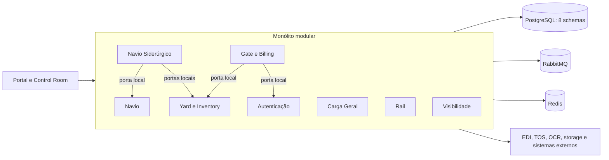

# CloudPort

O CloudPort é uma plataforma para operações portuárias com módulos de Navio, planejamento de contêineres, carga geral e break-bulk, carga siderúrgica, Yard, Gate, Rail, Inventory Management, Billing/CAP, Autenticação, Visibilidade e Control Room.

## Estado funcional

| Domínio | Funcionalidades disponíveis |
| --- | --- |
| Navio | cadastro e visitas, itens de embarque, descarga e restow, plano de estiva, quay monitor, crane plan, produtividade de cais e line-up operacional |
| Vessel Planner | profile, top, section e tier views sincronizadas, drag-and-drop, inspector de slot, legendas, tampas de porão, peso por stack, alertas, restow, sequência de guindastes e overlays técnicos |
| Yard | mapa georreferenciado, grade operacional, vistas de bloco, scan, seção e microvisão, heatmaps, movimentação gráfica, restrições, notas, allocations, simulação, rotas, CHEs e reefers |
| Gate | facilities, Gates, pistas, estágios, business tasks, bookings, BL, EDO, ERO, IDO, pré-avisos, appointments, truck visits, inspeções, troubles, documentos, EIR e transferências |
| Gate visual | quadro de pistas e filas, calendário, capacidade das janelas, jornada do veículo, OCR, balança, inspeção, liberação, avarias, SLA e transações problemáticas |
| Rail | visitas ferroviárias, composição gráfica do trem, locomotivas, vagões, linhas, ocupação, carga por vagão, progresso, drag-and-drop, conflitos e line-up vertical |
| Inventory Management | ciclo de vida de unidades e equipamentos, contêiner, chassi, carreta, acessórios, tipos, prefixos, lacres, documentos, avarias, manutenção, holds, permissions, ownership, reefer e inventário físico |
| Carga geral | Bill of Lading, itens, cargo lots, commodities, embalagens, produtos, códigos de armazenagem e manuseio, perigosos, temperatura, avarias, estoque, carga parcial e consolidação |
| Billing/CAP | tarifas, cobranças, faturas, itens, pagamentos, quitação e portal da transportadora isolado pelos dados do JWT |
| Control Room | work queues, job lists, dispatch, transições oficiais, telemetria, alarmes, indisponibilidades, equipamentos, SSE e integração com Navio, Yard e Quay |
| Visibilidade | dashboard, rastreamento, histórico, alertas globais, reconhecimento, resolução, filtros e atualização orientada a eventos |
| EDI e integrações | BAPLIE, COPRAR, COARRI e VERMAS, auditoria, idempotência, processamento assíncrono, retentativa, quarentena, SSE, WebSocket e API pública protegida |

## Interface compartilhada

O portal React possui uma grade operacional reutilizável com busca, filtros combináveis, ordenação, paginação, seleção múltipla, ações em lote, colunas configuráveis, layouts salvos, inspector lateral e exportações CSV e Excel. As exportações neutralizam conteúdo que possa ser interpretado como fórmula por aplicativos de planilha.

Também estão disponíveis:

- central global de alertas no cabeçalho e em `/home/alertas`;
- ajuda contextual por rota e módulo, acessível pelo botão de ajuda, `F1` ou `Shift + ?`;
- navegação por perfil e papéis;
- line-up vertical de navios e trens;
- telas operacionais responsivas e acessíveis para Gate, Rail, Yard, Navio, Embarque, Billing e administração.

## Ponto de entrada canônico

O backend oficial é o monólito modular executado por `backend/cloudport-runtime`.

O diretório `backend/cloudport-monolito-navio` representa o primeiro corte do monólito e permanece disponível exclusivamente para rollback. Ele não deve ser usado em novos comandos de build, execução ou implantação principal.

A arquitetura vigente possui:

- um processo Spring Boot e uma origem de API;
- limites de domínio preservados por módulos, pacotes, portas e eventos;
- chamadas locais entre módulos incorporados;
- segurança, CORS, Jackson, erros, logs, métricas, tracing e agendamento centralizados;
- PostgreSQL compartilhado, com schema e histórico Flyway próprios por módulo;
- RabbitMQ e Redis para integrações e projeções operacionais;
- HTTP e mensageria restritos a integrações externas ou ao período de rollback.

Não devem ser criados novos microsserviços para funcionalidades internas sem decisão arquitetural explícita.

## Estado da migração

| Componente | Estado no código | Estado operacional |
| --- | --- | --- |
| Autenticação | incorporada ao `cloudport-runtime` | runtime canônico |
| Carga Geral | incorporada ao `cloudport-runtime` | runtime canônico |
| Gate | incorporado ao `cloudport-runtime` | runtime canônico |
| Rail | incorporado ao `cloudport-runtime` | runtime canônico |
| Visibilidade | incorporada ao `cloudport-runtime` | runtime canônico |
| Yard e Inventory | incorporados ao `cloudport-runtime` | runtime canônico |
| Navio | incorporado ao `cloudport-runtime` | runtime canônico |
| Navio Siderúrgico | incorporado ao `cloudport-runtime` | runtime canônico |
| Portal principal | React 19 e Vite 8 | consome uma origem de API configurável |
| Control Room | React incorporado | servido pelo runtime consolidado |
| `cloudport-monolito-navio` | preservado | rollback intermediário somente |

Os diretórios `backend/servico-*` representam módulos. Eles continuam compiláveis isoladamente durante a janela de retorno, mas não definem a arquitetura alvo.

## Visão do runtime


```mermaid
flowchart LR
    FE[Portal e Control Room] --> API[cloudport-runtime :8080]

    subgraph API[Monólito modular]
        AUTH[Autenticação]
        CGO[Carga Geral]
        GATE[Gate e Billing]
        RAIL[Rail]
        YARD[Yard e Inventory]
        NAVIO[Navio]
        SID[Navio Siderúrgico]
        VIS[Visibilidade]

        SID -->|porta local| NAVIO
        SID -->|portas locais| YARD
        GATE -->|porta local| YARD
        GATE -->|porta local| AUTH
    end

    API --> PG[(PostgreSQL: 8 schemas)]
    API --> MQ[(RabbitMQ)]
    API --> REDIS[(Redis)]
    API --> EXT[EDI, TOS, OCR, storage e sistemas externos]
```

## Estrutura relevante

```text
backend/
├── cloudport-contracts/           # contratos, paginação, eventos e enums compartilhados
├── cloudport-modules/             # reator Maven canônico
├── cloudport-runtime/             # ponto de entrada Spring Boot canônico
├── cloudport-monolito-navio/      # runtime anterior, somente rollback
├── servico-carga-geral/
├── servico-navio/
├── servico-navio-siderurgico/
├── servico-yard/
├── servico-gate/
├── servico-rail/
├── servico-autenticacao/
└── servico-visibilidade/

frontend/
├── cloudport/                     # portal principal React
└── servico-navio-siderurgico/     # Control Room React
```

## Compilar e testar

Pré-requisitos: JDK 17, Maven 3.9+ e Docker.

```bash
cd backend/cloudport-modules
mvn -B -N -f ../cloudport-navio-modules/pom.xml -DskipTests install
mvn -B -Dspring-boot.repackage.skip=true \
  -pl :cloudport-runtime -am \
  -DskipTests install
mvn -B -pl :cloudport-runtime test package
```

O build inclui `cloudport-contracts`, os oito módulos operacionais e o runtime. A validação cobre PostgreSQL/Testcontainers, históricos Flyway, segurança única, portas locais e regras ArchUnit.

## Executar o backend

Variáveis mínimas:

```bash
export SPRING_DATASOURCE_URL='jdbc:postgresql://localhost:5432/cloudport'
export SPRING_DATASOURCE_USERNAME='cloudport'
export SPRING_DATASOURCE_PASSWORD='cloudport'
export CLOUDPORT_SECURITY_JWT_SECRET='substitua-por-segredo-com-pelo-menos-32-bytes'
export CLOUDPORT_SECURITY_JWT_EXPIRATION='PT2H'
export RABBITMQ_HOST='localhost'
export RABBITMQ_USERNAME='guest'
export RABBITMQ_PASSWORD='guest'
export REDIS_HOST='localhost'
export REDIS_PORT='6379'
```

Após compilar:

```bash
java -jar backend/cloudport-runtime/target/cloudport-runtime-*.jar
```

## Executar o frontend

```bash
cd frontend/cloudport
npm install --no-audit --no-fund
npm start
```

A aplicação de desenvolvimento fica disponível em `http://localhost:4200`.

## Docker Compose

```bash
export POSTGRES_PASSWORD='substitua-a-senha-do-postgres'
export RABBITMQ_PASSWORD='substitua-a-senha-do-rabbitmq'
export JWT_SECRET='substitua-por-segredo-com-pelo-menos-32-bytes'
export CLOUDPORT_INTERNAL_SERVICE_KEY='substitua-a-chave-interna'
export SECURITY_CORS_ALLOWED_ORIGINS='http://localhost:4200,http://localhost:8080'
export TOS_API_BASE_URL='http://localhost:8090'

docker compose \
  -f deploy/cloudport-runtime/docker-compose.yml \
  up -d --build
```

A origem padrão da API é `http://localhost:8080`.

## EasyPanel

### Backend

- caminho de build: `/backend`;
- arquivo: `Dockerfile`;
- porta: `8080`;
- health check: `/actuator/health/readiness`.

O `backend/Dockerfile` instala o parent Maven, compila o reator completo, inclui `cloudport-contracts`, gera o JAR do runtime e prepara `/var/lib/cloudport/documents` para persistência.

### Frontend

- caminho de build: `/frontend`;
- arquivo: `Dockerfile`;
- porta: `80`;
- health check: `/health`.

O `frontend/Dockerfile` compila `frontend/cloudport` com Node 22 e publica os arquivos estáticos no Nginx. A configuração do Nginx possui fallback para SPA.

## Rollback

O runtime anterior exige ativação explícita de rollback e possui implementações locais para todas as portas obrigatórias do Yard. A execução direta permanece desativada por padrão.

Use o runbook antes de iniciar `backend/cloudport-monolito-navio` ou o Compose em `deploy/navio-monolito`.

## Documentação

- Arquitetura: [`docs/arquitetura-monolito-modular.md`](docs/arquitetura-monolito-modular.md)
- Corte e rollback: [`docs/operacao-corte-rollback-navio.md`](docs/operacao-corte-rollback-navio.md)
- Runtime canônico: [`backend/cloudport-runtime/README.md`](backend/cloudport-runtime/README.md)
- Frontend: [`frontend/cloudport/README.md`](frontend/cloudport/README.md)
- Runtime anterior de rollback: [`backend/cloudport-monolito-navio/README.md`](backend/cloudport-monolito-navio/README.md)
- Pendências técnicas auditadas: [`docs/requisitos/requisito-tecnico.md`](docs/requisitos/requisito-tecnico.md)
- Lacunas funcionais remanescentes: [`docs/requisitos/modulo-navios-back-front-gaps.md`](docs/requisitos/modulo-navios-back-front-gaps.md)
- Entregas consolidadas: [`docs/implementados/requisitos-implementados.md`](docs/implementados/requisitos-implementados.md)
