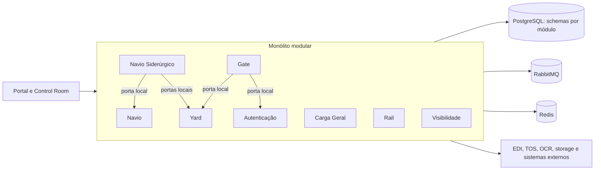

# CloudPort

O CloudPort é uma plataforma para operações portuárias com módulos de Navio, contêineres, carga geral e break-bulk, carga siderúrgica, Yard, Gate, Rail, Autenticação, Billing, CAP, Control Room e Visibilidade.

## Escopo funcional

Contêineres fazem parte do fluxo principal do CloudPort, com planejamento de recebimento no pátio, inventário, movimentações, gate, ferrovia, Bay Plan/BAPLIE e planejamento de estiva no navio.

Carga geral, carga de projeto e break-bulk possuem domínio próprio para Bill of Lading, itens do conhecimento, cargo lots, commodities, embalagens, produtos, armazenagem, manuseio, mercadorias perigosas, temperatura, avarias, estoque físico, carga e descarga parcial, consolidação, desconsolidação e vínculos com veículo, navio, armazém e cliente.

Bobinas de aço são atendidas por um módulo especializado de carga siderúrgica. Esse módulo complementa o planejamento de contêineres e de carga geral e não limita o escopo do sistema a bobinas.

## Funcionalidades operacionais disponíveis

### Navio e Vessel Planner

- visitas, itens operacionais, plano de estiva, eventos e integração com o pátio;
- line-up interno com simulação temporal, conflitos de berço e visão vertical;
- line-up público para clientes em `/line-up`;
- Vessel Planner com profile, top, section e tier views sincronizadas;
- drag-and-drop de contêineres, restow, sequência de guindastes, IMDG, reefer, OOG e pesos por stack;
- Quay Monitor, crane plan e produtividade planejada versus realizada;
- estabilidade e força estrutural calculadas a partir de dados persistidos e versionados.

### Yard e inventário

- mapa georreferenciado com blocos, pilhas, posições e camadas operacionais;
- vistas de bloco, seção, scan e microvisão;
- heatmaps de ocupação e dwell time;
- workspaces salvos, notas, bloqueios, interdições e permissões de pilha;
- movimentação simulada e confirmada com validação do destino no backend;
- telemetria de reefers, alarmes, rotas e editor gráfico de allocations;
- inventário canônico de contêineres, chassis, carretas e acessórios;
- lacres, documentos, avarias, manutenção, holds, ownership, montagem, histórico, reefer e inventário físico.

### Gate

- facilities, múltiplos gates, pistas, estágios, filas e business tasks;
- bookings, Bill of Lading, EDO, ERO, IDO, pré-avisos e appointments;
- truck visits com múltiplas transações, inspeções e trouble transactions;
- imagens, documentos, tickets, impressão e reimpressão de EIR;
- quadro visual das pistas, calendário, ocupação por janela, jornada do veículo e SLA;
- regras de acesso para motorista, transportadora e veículo;
- controle de entrada, presença e saída de pessoas;
- embarque direto de contêiner do gate para o navio sem passagem pelo pátio.

### Ferrovia

- visitas, manifestos, vagões, contêineres e ordens de trabalho;
- lista de trabalho e ciclo de chegada, processamento, conclusão e partida;
- composição gráfica de locomotiva e vagões;
- linhas ferroviárias, ocupação, conflitos e progresso por vagão;
- line-up ferroviário vertical;
- fluxo de locomotiva isolada recebida pela ferrovia e embarcada no navio.

### Carga geral, Billing e CAP

- Bill of Lading, itens, cargo lots e estoque de carga geral, projeto e break-bulk;
- recebimento, transferência, carga e descarga parcial, consolidação e desconsolidação;
- referências de commodities, embalagens, produtos, perigosos, temperatura, avarias e manuseio;
- tarifas, cobranças, faturas e pagamentos;
- portal CAP isolado pelos dados da transportadora autenticada.

### Control Room e Visibilidade

- work queues, job lists, dispatch e transições de work instruction;
- equipamentos, telemetria, dispositivos, comandos remotos e indisponibilidades;
- atualizações por SSE com reconexão e fallback;
- central global de alertas com reconhecimento, resolução e navegação ao módulo de origem;
- rastreamento e histórico de contêineres;
- grade operacional com busca, filtros, ordenação, paginação, seleção múltipla, inspector e layouts salvos;
- exportação CSV e Excel protegida contra injeção de fórmulas;
- ajuda contextual integrada às páginas do portal.

## Ponto de entrada canônico

O backend oficial é o monólito modular executado por `backend/cloudport-runtime`.

O diretório `backend/cloudport-monolito-navio` representa o primeiro corte do monólito e permanece disponível exclusivamente para rollback. Ele não deve ser usado em novos comandos de build, execução ou implantação principal.

A arquitetura vigente possui:

- um processo Spring Boot e uma origem de API;
- limites de domínio preservados por módulos, pacotes, portas e eventos;
- chamadas locais entre módulos incorporados;
- segurança, CORS, Jackson, erros, logs, métricas, tracing e agendamento centralizados;
- PostgreSQL compartilhado, com schema e histórico Flyway próprios por módulo;
- HTTP e mensageria restritos a integrações externas ou ao período de rollback.

Não devem ser criados novos microsserviços para funcionalidades internas sem decisão arquitetural explícita.

## Estado da migração

| Componente | Estado no código | Estado operacional |
| --- | --- | --- |
| Autenticação | Incorporada ao `cloudport-runtime` | runtime canônico |
| Carga Geral | Incorporada ao `cloudport-runtime` | runtime canônico |
| Gate | Incorporado ao `cloudport-runtime` | runtime canônico |
| Rail | Incorporado ao `cloudport-runtime` | runtime canônico |
| Visibilidade | Incorporada ao `cloudport-runtime` | runtime canônico |
| Yard | Incorporado ao `cloudport-runtime` | runtime canônico |
| Navio | Incorporado ao `cloudport-runtime` | runtime canônico |
| Navio Siderúrgico | Incorporado ao `cloudport-runtime` | runtime canônico |
| Portal principal | React | consome uma origem de API configurável |
| Control Room | React incorporado | servido pelo runtime consolidado |
| `cloudport-monolito-navio` | preservado | rollback intermediário somente |

Os diretórios `backend/servico-*` representam módulos. Eles continuam compiláveis isoladamente durante a janela de retorno, mas não definem a arquitetura alvo.

## Visão do runtime


```mermaid
flowchart LR
    FE[Portal e Control Room] --> API[cloudport-runtime :8080]

    subgraph API[Monólito modular]
        AUTH[Autenticação]
        CGO[Carga Geral]
        GATE[Gate]
        RAIL[Rail]
        YARD[Yard]
        NAVIO[Navio]
        SID[Navio Siderúrgico]
        VIS[Visibilidade]

        SID -->|porta local| NAVIO
        SID -->|portas locais| YARD
        GATE -->|porta local| YARD
        GATE -->|porta local| AUTH
    end

    API --> PG[(PostgreSQL: schemas por módulo)]
    API --> MQ[(RabbitMQ)]
    API --> REDIS[(Redis)]
    API --> EXT[EDI, TOS, OCR, storage e sistemas externos]
```

## Estrutura relevante

```text
backend/
├── cloudport-modules/             # parent e reator Maven canônico
├── cloudport-contracts/           # contratos compartilhados
├── cloudport-runtime/             # ponto de entrada Spring Boot canônico
├── cloudport-monolito-navio/      # runtime anterior, somente rollback
├── servico-carga-geral/
├── servico-navio/
├── servico-navio-siderurgico/
├── servico-yard/
├── servico-gate/
├── servico-rail/
├── servico-autenticacao/
└── servico-visibilidade/

frontend/
├── cloudport/                     # portal principal React
└── servico-navio-siderurgico/     # Control Room React
```

## Compilar e testar

Pré-requisitos: JDK 17, Maven 3.9+ e Docker.

```bash
cd backend/cloudport-modules
mvn -B -Dspring-boot.repackage.skip=true \
  -pl :cloudport-runtime -am \
  -DskipTests install
mvn -B -pl :cloudport-runtime test package
```

O build inclui contratos, os oito módulos de domínio e o runtime. A validação cobre PostgreSQL/Testcontainers, históricos Flyway, segurança única, portas locais, regras ArchUnit e empacotamento Docker.

## Executar

Variáveis mínimas:

```bash
export SPRING_DATASOURCE_URL='jdbc:postgresql://localhost:5432/cloudport'
export SPRING_DATASOURCE_USERNAME='cloudport'
export SPRING_DATASOURCE_PASSWORD='cloudport'
export CLOUDPORT_SECURITY_JWT_SECRET='substitua-por-segredo-com-pelo-menos-32-bytes'
export API_SECURITY_TOKEN_SECRET="$CLOUDPORT_SECURITY_JWT_SECRET"
export RABBITMQ_HOST='localhost'
export REDIS_HOST='localhost'
```

Após compilar:

```bash
java -jar backend/cloudport-runtime/target/cloudport-runtime-*.jar
```

## Docker Compose

```bash
export POSTGRES_PASSWORD='substitua-a-senha-do-postgres'
export RABBITMQ_PASSWORD='substitua-a-senha-do-rabbitmq'
export JWT_SECRET='substitua-por-segredo-com-pelo-menos-32-bytes'
export CLOUDPORT_INTERNAL_SERVICE_KEY='substitua-a-chave-interna'
export SECURITY_CORS_ALLOWED_ORIGINS='http://localhost:4200,http://localhost:8080'
export TOS_API_BASE_URL='http://localhost:8090'

docker compose \
  -f deploy/cloudport-runtime/docker-compose.yml \
  up -d --build
```

A origem padrão da API é `http://localhost:8080`.

## Implantação no EasyPanel

### Frontend

| Campo | Valor |
| --- | --- |
| Caminho de Build | `/frontend` |
| Construção | `Dockerfile` |
| Arquivo | `Dockerfile` |
| Porta | `80` |
| Health check | `/health` |

O Dockerfile compila `frontend/cloudport` com Node 22 e publica o conteúdo por Nginx com fallback para SPA.

### Backend

| Campo | Valor |
| --- | --- |
| Caminho de Build | `/backend` |
| Construção | `Dockerfile` |
| Arquivo | `Dockerfile` |
| Porta | `8080` |
| Health check | `/actuator/health/readiness` |

O Dockerfile do backend instala o parent Maven, empacota contratos, Carga Geral e os demais módulos, prepara o diretório persistente de documentos e inicia o runtime canônico.

## Rollback

O runtime anterior exige ativação explícita de rollback e possui implementações locais para todas as portas obrigatórias do Yard. A execução direta permanece desativada por padrão.

Use o runbook antes de iniciar `backend/cloudport-monolito-navio` ou o Compose em `deploy/navio-monolito`.

## Documentação

- Arquitetura: [`docs/arquitetura-monolito-modular.md`](docs/arquitetura-monolito-modular.md)
- Corte e rollback: [`docs/operacao-corte-rollback-navio.md`](docs/operacao-corte-rollback-navio.md)
- Runtime canônico: [`backend/cloudport-runtime/README.md`](backend/cloudport-runtime/README.md)
- Runtime anterior de rollback: [`backend/cloudport-monolito-navio/README.md`](backend/cloudport-monolito-navio/README.md)
- Backlog funcional e de integração: [`docs/requisitos/modulo-navios-back-front-gaps.md`](docs/requisitos/modulo-navios-back-front-gaps.md)
- Pendências técnicas comprovadas: [`docs/requisitos/requisito-tecnico.md`](docs/requisitos/requisito-tecnico.md)
- Entregas implementadas: [`docs/implementados/requisitos-implementados.md`](docs/implementados/requisitos-implementados.md)
