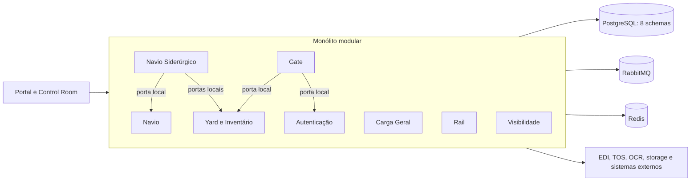

# CloudPort

O CloudPort é uma plataforma de operações portuárias construída como monólito modular Spring Boot, com portal React e domínios de Navio, Vessel Planner, Yard, Inventário, Gate, Ferrovia, Carga Geral e Break-Bulk, Carga Siderúrgica, Billing/CAP, Autenticação, Control Room e Visibilidade.

## Capacidades operacionais

| Domínio | Capacidades entregues |
| --- | --- |
| Navio e Vessel Planner | escalas, itens de embarque/descarga/restow, Bay Plan/BAPLIE, profile/top/section/tier sincronizados, drag-and-drop, tampas de porão, peso por stack, IMDG, reefer, OOG, sequência de guindastes e overlays técnicos |
| Yard | mapa georreferenciado, bloco/scan/seção/microvisão, heatmaps, posições e pilhas, reservas, allocations, movimentação gráfica, restrições, notas, workspaces, simulação, rotas, CHEs e telemetria reefer |
| Inventário | unidade e equipamento canônicos, contêiner, chassi, carreta, acessórios, tipos, prefixos, lacres, documentos, avarias, manutenção, holds/permissions, vínculos, reefer e inventário físico |
| Gate | facilities, Gates, pistas, estágios, business tasks, bookings, Bill of Lading, ordens, pré-avisos, appointments, truck visits, inspeções, trouble transactions, documentos, imagens, EIR e monitor visual |
| Ferrovia | visitas, composição gráfica, locomotivas e vagões, ocupação das linhas, carga/descarga por vagão, cronograma, conflitos e planejamento visual |
| Carga Geral | Bill of Lading, itens, cargo lots, commodities, embalagens, produtos, perigosos, temperatura, avarias, estoque, movimentações parciais, consolidação e vínculos logísticos |
| Control Room | work queues, job lists, dispatch, transições operacionais, equipamentos, telemetria, dispositivos, comandos remotos, alarmes, indisponibilidades, SSE e Quay Monitor |
| Billing e CAP | tarifas, cobranças, faturas, itens, pagamentos, isolamento por transportadora e portal de autoatendimento |
| Visibilidade | rastreamento, histórico, dashboards, alertas globais, reconhecimento/resolução, projeções e eventos operacionais versionados |
| Portal | grade operacional com busca, filtros, paginação, seleção, inspector, CSV/Excel seguro, colunas dinâmicas e ajuda contextual por rota |

## Ponto de entrada canônico

O backend oficial é o runtime `backend/cloudport-runtime`, compilado pelo reator `backend/cloudport-modules`.

O diretório `backend/cloudport-monolito-navio` representa o primeiro corte do monólito e permanece disponível exclusivamente para rollback intermediário. Ele não deve ser usado em novos comandos de implantação principal.

A arquitetura vigente possui:

- um processo Spring Boot e uma origem de API;
- oito módulos de negócio incorporados ao runtime;
- limites de domínio preservados por pacotes, portas e eventos internos;
- segurança, CORS, Jackson, erros, logs, métricas, tracing e agendamento centralizados;
- PostgreSQL compartilhado com oito schemas e históricos Flyway independentes;
- HTTP e mensageria restritos a integrações externas ou ao período de rollback.

Não devem ser criados novos microsserviços para funcionalidades internas sem decisão arquitetural explícita.

## Módulos incorporados

| Componente | Estado operacional |
| --- | --- |
| Autenticação | incorporada ao runtime canônico |
| Carga Geral | incorporada ao runtime canônico |
| Gate | incorporado ao runtime canônico |
| Rail | incorporado ao runtime canônico |
| Visibilidade | incorporada ao runtime canônico |
| Yard e Inventário | incorporados ao runtime canônico |
| Navio | incorporado ao runtime canônico |
| Navio Siderúrgico | incorporado ao runtime canônico |
| Portal principal | React, consumindo uma origem configurável |
| Control Room | React incorporado e servido pelo runtime |
| `cloudport-monolito-navio` | somente rollback intermediário |

Os diretórios `backend/servico-*` representam módulos. Eles permanecem compiláveis isoladamente durante a janela de retorno, mas não definem a arquitetura alvo.

## Visão do runtime


```mermaid
flowchart LR
    FE[Portal e Control Room] --> API[cloudport-runtime :8080]

    subgraph API[Monólito modular]
        AUTH[Autenticação]
        CGO[Carga Geral]
        GATE[Gate]
        RAIL[Rail]
        VIS[Visibilidade]
        YARD[Yard e Inventário]
        NAVIO[Navio]
        SID[Navio Siderúrgico]

        SID -->|porta local| NAVIO
        SID -->|portas locais| YARD
        GATE -->|porta local| YARD
        GATE -->|porta local| AUTH
    end

    API --> PG[(PostgreSQL: 8 schemas)]
    API --> MQ[(RabbitMQ)]
    API --> REDIS[(Redis)]
    API --> EXT[EDI, TOS, OCR, storage e sistemas externos]
```

## Estrutura relevante

```text
backend/
├── cloudport-contracts/           # contratos compartilhados
├── cloudport-modules/             # reator Maven canônico
├── cloudport-runtime/             # ponto de entrada Spring Boot canônico
├── cloudport-monolito-navio/      # runtime anterior, somente rollback
├── servico-autenticacao/
├── servico-carga-geral/
├── servico-gate/
├── servico-rail/
├── servico-visibilidade/
├── servico-yard/
├── servico-navio/
└── servico-navio-siderurgico/

frontend/
├── cloudport/                     # portal principal React
└── servico-navio-siderurgico/     # Control Room React
```

## Compilar e testar

Pré-requisitos: JDK 17, Maven 3.9+ e Docker.

```bash
cd backend/cloudport-modules
mvn -B -N -f ../cloudport-navio-modules/pom.xml -DskipTests install
mvn -B -Dspring-boot.repackage.skip=true \
  -pl :cloudport-runtime -am \
  -DskipTests install
mvn -B -pl :cloudport-runtime test package
```

O build valida os oito módulos, `cloudport-contracts`, PostgreSQL/Testcontainers, históricos Flyway, segurança única, portas locais e regras ArchUnit.

## Executar o backend

Variáveis mínimas:

```bash
export SPRING_DATASOURCE_URL='jdbc:postgresql://localhost:5432/cloudport'
export SPRING_DATASOURCE_USERNAME='cloudport'
export SPRING_DATASOURCE_PASSWORD='cloudport'
export CLOUDPORT_SECURITY_JWT_SECRET='substitua-por-segredo-com-pelo-menos-32-bytes'
export CLOUDPORT_SECURITY_JWT_EXPIRATION='PT2H'
export SPRING_RABBITMQ_HOST='localhost'
export SPRING_RABBITMQ_USERNAME='cloudport'
export SPRING_RABBITMQ_PASSWORD='cloudport'
export SPRING_REDIS_HOST='localhost'
export SPRING_REDIS_PORT='6379'
```

Após compilar:

```bash
java -jar backend/cloudport-runtime/target/cloudport-runtime-*.jar
```

## Docker Compose

```bash
export POSTGRES_PASSWORD='substitua-a-senha-do-postgres'
export RABBITMQ_PASSWORD='substitua-a-senha-do-rabbitmq'
export JWT_SECRET='substitua-por-segredo-com-pelo-menos-32-bytes'
export CLOUDPORT_INTERNAL_SERVICE_KEY='substitua-a-chave-interna'
export SECURITY_CORS_ALLOWED_ORIGINS='http://localhost:4200,http://localhost:8080'
export TOS_API_BASE_URL='http://localhost:8090'

docker compose \
  -f deploy/cloudport-runtime/docker-compose.yml \
  up -d --build
```

A origem padrão da API é `http://localhost:8080`.

## EasyPanel

### Backend

- caminho de build: `/backend`;
- construção/arquivo: `Dockerfile`;
- porta: `8080`;
- health check: `/actuator/health/readiness`.

O arquivo correto para esse contexto é `backend/Dockerfile`.

### Frontend

- caminho de build: `/frontend`;
- construção/arquivo: `Dockerfile`;
- porta: `80`;
- health check: `/health`.

O Nginx possui fallback de SPA para `index.html`.

## Rollback

O runtime anterior exige `CLOUDPORT_ROLLBACK_ENABLED=true` e possui adaptadores locais para as portas obrigatórias do Yard. Escrita, jobs e consumidores permanecem desativados por padrão.

Use o runbook antes de iniciar `backend/cloudport-monolito-navio` ou o Compose em `deploy/navio-monolito`.

## Documentação

- Arquitetura: [`docs/arquitetura-monolito-modular.md`](docs/arquitetura-monolito-modular.md)
- Corte e rollback: [`docs/operacao-corte-rollback-navio.md`](docs/operacao-corte-rollback-navio.md)
- Runtime canônico: [`backend/cloudport-runtime/README.md`](backend/cloudport-runtime/README.md)
- Runtime anterior: [`backend/cloudport-monolito-navio/README.md`](backend/cloudport-monolito-navio/README.md)
- Pendências funcionais: [`docs/requisitos/modulo-navios-back-front-gaps.md`](docs/requisitos/modulo-navios-back-front-gaps.md)
- Pendências técnicas auditadas: [`docs/requisitos/requisito-tecnico.md`](docs/requisitos/requisito-tecnico.md)
- Entregas: [`docs/implementados/requisitos-implementados.md`](docs/implementados/requisitos-implementados.md)
