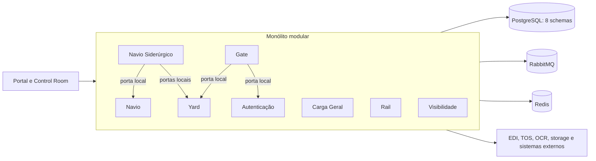

# CloudPort

Status da documentação: atualizado em 2026-07-18 com as entregas incorporadas à `main` até o PR #393.

O CloudPort é uma plataforma para operações portuárias com módulos de Navio, contêineres, carga geral e break-bulk, carga siderúrgica, Yard, Gate, Rail, Autenticação, Billing, CAP, Control Room e Visibilidade.

## Escopo funcional

O sistema cobre atualmente:

- planejamento e execução de visitas de navio, descarga, embarque, restow, crane plan e estiva;
- Vessel Planner gráfico com vistas profile, top, section e tier, movimentação por drag-and-drop, restrições, segregação IMDG, peso por stack e sobreposições operacionais;
- Yard georreferenciado com mapa, bloco, seção, scan e microvisão, workspaces, simulação de movimentos, restrições de pilha, allocations, rotas, reefers e telemetria de CHEs;
- inventário canônico de contêineres, chassis, carretas e acessórios, incluindo lacres, documentos, avarias, holds, manutenção, vínculos e divergências físicas;
- Gate operacional com facilities, gates, lanes, estágios, appointments, truck visits, business tasks, trouble transactions, inspeções, documentos, imagens, tickets e EIR;
- carga geral, carga de projeto e break-bulk com Bill of Lading, itens, cargo lots, commodities, embalagens, produtos, códigos de armazenagem/manuseio, perigosos, temperatura, avarias e estoque físico;
- ferrovia com line-up, linhas, composição gráfica, locomotivas, vagões, conflitos, progresso e planejamento visual;
- Control Room com equipamentos, work queues, job lists, telemetria, alarmes, dispositivos e comandos remotos;
- Billing e portal CAP com tarifas, cobranças, faturas, pagamentos e visão isolada por transportadora;
- central global de alertas e visibilidade operacional de Gate, Rail, Yard e Navio;
- EDI com BAPLIE, COPRAR, COARRI e VERMAS, auditoria, idempotência, processamento assíncrono, retentativa e quarentena;
- grade operacional compartilhada com busca, filtros, ordenação, paginação, seleção múltipla, inspector, layouts salvos e exportação CSV/Excel segura;
- ajuda contextual por rota em todas as páginas que utilizam o cabeçalho compartilhado.

Bobinas de aço são atendidas por um módulo especializado de carga siderúrgica. Esse módulo complementa o planejamento de contêineres e de carga geral e não limita o escopo do sistema a bobinas.

## Ponto de entrada canônico

O backend oficial é o monólito modular executado por `backend/cloudport-runtime`.

O diretório `backend/cloudport-monolito-navio` representa o primeiro corte do monólito e permanece disponível exclusivamente para rollback intermediário. Ele não deve ser usado em novos comandos de build, execução ou implantação principal.

A arquitetura vigente possui:

- um processo Spring Boot e uma origem de API;
- oito módulos de domínio preservados por pacotes, portas e eventos;
- chamadas locais entre módulos incorporados;
- segurança, CORS, Jackson, erros, logs, métricas, tracing e agendamento centralizados no runtime;
- PostgreSQL compartilhado, com schema e histórico Flyway próprios por módulo;
- HTTP e mensageria restritos a integrações externas ou à janela de rollback.

Não devem ser criados novos microsserviços para funcionalidades internas sem decisão arquitetural explícita.

## Estado da migração

| Componente | Estado no código | Estado operacional |
| --- | --- | --- |
| Autenticação | Incorporada ao `cloudport-runtime` | runtime canônico |
| Carga Geral | Incorporada ao `cloudport-runtime` | runtime canônico |
| Gate | Incorporado ao `cloudport-runtime` | runtime canônico |
| Rail | Incorporado ao `cloudport-runtime` | runtime canônico |
| Visibilidade | Incorporada ao `cloudport-runtime` | runtime canônico |
| Yard | Incorporado ao `cloudport-runtime` | runtime canônico |
| Navio | Incorporado ao `cloudport-runtime` | runtime canônico |
| Navio Siderúrgico | Incorporado ao `cloudport-runtime` | runtime canônico |
| Portal principal | React | imagem própria ou origem configurável |
| Control Room | React incorporado | servido pelo runtime consolidado |
| `cloudport-monolito-navio` | preservado | rollback intermediário somente |

Os diretórios `backend/servico-*` representam módulos. Eles continuam compiláveis isoladamente durante a janela de retorno, mas não definem a arquitetura alvo.

## Visão do runtime


```mermaid
flowchart LR
    FE[Portal e Control Room] --> API[cloudport-runtime :8080]

    subgraph API[Monólito modular]
        AUTH[Autenticação]
        CGO[Carga Geral]
        GATE[Gate]
        RAIL[Rail]
        YARD[Yard]
        NAVIO[Navio]
        SID[Navio Siderúrgico]
        VIS[Visibilidade]

        SID -->|porta local| NAVIO
        SID -->|portas locais| YARD
        GATE -->|porta local| YARD
        GATE -->|porta local| AUTH
    end

    API --> PG[(PostgreSQL: 8 schemas)]
    API --> MQ[(RabbitMQ)]
    API --> REDIS[(Redis)]
    API --> EXT[EDI, TOS, OCR, storage e sistemas externos]
```

## Estrutura relevante

```text
backend/
├── cloudport-navio-modules/       # parent Maven compartilhado
├── cloudport-modules/             # reator Maven canônico
├── cloudport-contracts/           # contratos compartilhados
├── cloudport-runtime/             # ponto de entrada Spring Boot canônico
├── cloudport-monolito-navio/      # runtime anterior, somente rollback
├── servico-autenticacao/
├── servico-carga-geral/
├── servico-gate/
├── servico-navio/
├── servico-navio-siderurgico/
├── servico-rail/
├── servico-visibilidade/
└── servico-yard/

frontend/
├── Dockerfile                     # implantação do portal no EasyPanel
├── nginx.conf                     # SPA, cache e health do portal
├── cloudport/                     # portal principal React
└── servico-navio-siderurgico/     # Control Room React
```

## Compilar e testar

Pré-requisitos: JDK 17, Maven 3.9+ e Docker.

```bash
cd backend/cloudport-modules
mvn -B -N -f ../cloudport-navio-modules/pom.xml -DskipTests install
mvn -B -Dspring-boot.repackage.skip=true \
  -pl :cloudport-runtime -am \
  -DskipTests install
mvn -B -pl :cloudport-runtime test package
```

O build inclui os oito módulos, `cloudport-contracts` e o runtime. A validação cobre PostgreSQL/Testcontainers, históricos Flyway, segurança única, portas locais, regras ArchUnit e construção das imagens Docker nos contextos suportados.

## Executar o backend

Variáveis mínimas do runtime:

```bash
export SPRING_DATASOURCE_URL='jdbc:postgresql://localhost:5432/cloudport'
export SPRING_DATASOURCE_USERNAME='cloudport'
export SPRING_DATASOURCE_PASSWORD='cloudport'
export CLOUDPORT_SECURITY_JWT_SECRET='substitua-por-segredo-com-pelo-menos-32-bytes'
export CLOUDPORT_SECURITY_JWT_EXPIRATION='PT2H'
export SPRING_RABBITMQ_HOST='localhost'
export SPRING_RABBITMQ_USERNAME='cloudport'
export SPRING_RABBITMQ_PASSWORD='cloudport'
export SPRING_REDIS_HOST='localhost'
export SPRING_REDIS_PORT='6379'
```

Após compilar:

```bash
java -jar backend/cloudport-runtime/target/cloudport-runtime-*.jar
```

Health de prontidão: `GET /actuator/health/readiness`.

## Docker Compose

```bash
export POSTGRES_PASSWORD='substitua-a-senha-do-postgres'
export RABBITMQ_PASSWORD='substitua-a-senha-do-rabbitmq'
export JWT_SECRET='substitua-por-segredo-com-pelo-menos-32-bytes'
export CLOUDPORT_INTERNAL_SERVICE_KEY='substitua-a-chave-interna'
export SECURITY_CORS_ALLOWED_ORIGINS='http://localhost:4200,http://localhost:8080'
export TOS_API_BASE_URL='http://localhost:8090'

docker compose \
  -f deploy/cloudport-runtime/docker-compose.yml \
  up -d --build
```

A origem padrão da API é `http://localhost:8080`.

## Implantação no EasyPanel

### Backend

- repositório: `diogo2806/CloudPort`;
- branch: `main`;
- caminho de build: `/backend`;
- construção: `Dockerfile`;
- arquivo: `Dockerfile`;
- porta: `8080`;
- health check: `/actuator/health/readiness`.

O `backend/Dockerfile` é o arquivo preparado para o contexto `/backend`. O `backend/cloudport-runtime/Dockerfile` permanece destinado ao build executado a partir da raiz do repositório.

### Frontend

- repositório: `diogo2806/CloudPort`;
- branch: `main`;
- caminho de build: `/frontend`;
- arquivo: `Dockerfile`;
- porta: `80`;
- health check: `/health`.

A imagem compila `frontend/cloudport`, publica o artefato em Nginx e aplica fallback de SPA para `index.html`.

## Rollback

O runtime anterior exige `CLOUDPORT_ROLLBACK_ENABLED=true` e possui implementações locais para as portas obrigatórias do Yard. Escrita, jobs e consumidores permanecem desativados por padrão.

Use o runbook antes de iniciar `backend/cloudport-monolito-navio` ou o Compose em `deploy/navio-monolito`.

## Documentação

- Arquitetura: [`docs/arquitetura-monolito-modular.md`](docs/arquitetura-monolito-modular.md)
- Corte e rollback: [`docs/operacao-corte-rollback-navio.md`](docs/operacao-corte-rollback-navio.md)
- Runtime canônico: [`backend/cloudport-runtime/README.md`](backend/cloudport-runtime/README.md)
- Runtime anterior de rollback: [`backend/cloudport-monolito-navio/README.md`](backend/cloudport-monolito-navio/README.md)
- Pendências funcionais: [`docs/requisitos/modulo-navios-back-front-gaps.md`](docs/requisitos/modulo-navios-back-front-gaps.md)
- Pendências técnicas: [`docs/requisitos/requisito-tecnico.md`](docs/requisitos/requisito-tecnico.md)
- Entregas implementadas: [`docs/implementados/requisitos-implementados.md`](docs/implementados/requisitos-implementados.md)
