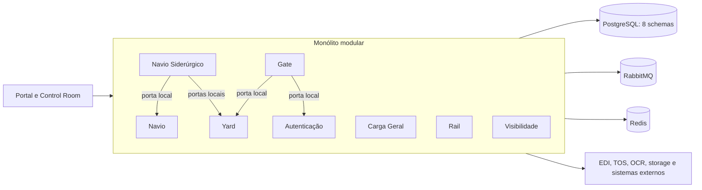

# CloudPort

O CloudPort é uma plataforma para operações portuárias com módulos de Navio, contêineres, carga geral e break-bulk, carga siderúrgica, Yard, Gate, Rail, Autenticação e Visibilidade.

## Escopo funcional

Contêineres fazem parte do fluxo principal do CloudPort, com planejamento de recebimento no pátio, inventário, movimentações, gate, ferrovia, Bay Plan/BAPLIE e planejamento de estiva no navio.

Carga geral, carga de projeto e break-bulk possuem domínio próprio para Bill of Lading, itens do conhecimento, cargo lots, commodities, embalagens, produtos, armazenagem, manuseio, mercadorias perigosas, temperatura, avarias, estoque físico, carga e descarga parcial, consolidação, desconsolidação e vínculos com veículo, navio, armazém e cliente.

Bobinas de aço são atendidas por um módulo especializado de carga siderúrgica. Esse módulo complementa o planejamento de contêineres e de carga geral e não limita o escopo do sistema a bobinas.

## Ponto de entrada canônico

O backend oficial é o monólito modular executado por `backend/cloudport-runtime`.

O diretório `backend/cloudport-monolito-navio` representa o primeiro corte do monólito e permanece disponível exclusivamente para rollback. Ele não deve ser usado em novos comandos de build, execução ou implantação principal.

A arquitetura vigente possui:

- um processo Spring Boot e uma origem de API;
- limites de domínio preservados por módulos, pacotes, portas e eventos;
- chamadas locais entre módulos incorporados;
- segurança, CORS, Jackson, erros, logs, métricas, tracing e agendamento centralizados;
- PostgreSQL compartilhado, com schema e histórico Flyway próprios por módulo;
- HTTP e mensageria restritos a integrações externas ou ao período de rollback.

Não devem ser criados novos microsserviços para funcionalidades internas sem decisão arquitetural explícita.

## Estado da migração

| Componente | Estado no código | Estado operacional |
| --- | --- | --- |
| Autenticação | Incorporada ao `cloudport-runtime` | runtime canônico |
| Carga Geral | Incorporada ao `cloudport-runtime` | runtime canônico |
| Gate | Incorporado ao `cloudport-runtime` | runtime canônico |
| Rail | Incorporado ao `cloudport-runtime` | runtime canônico |
| Visibilidade | Incorporada ao `cloudport-runtime` | runtime canônico |
| Yard | Incorporado ao `cloudport-runtime` | runtime canônico |
| Navio | Incorporado ao `cloudport-runtime` | runtime canônico |
| Navio Siderúrgico | Incorporado ao `cloudport-runtime` | runtime canônico |
| Portal principal | React | consome uma origem de API configurável |
| Control Room | React incorporado | servido pelo runtime consolidado |
| `cloudport-monolito-navio` | preservado | rollback intermediário somente |

Os diretórios `backend/servico-*` representam módulos. Eles continuam compiláveis isoladamente durante a janela de retorno, mas não definem a arquitetura alvo.

## Visão do runtime


```mermaid
flowchart LR
    FE[Portal e Control Room] --> API[cloudport-runtime :8080]

    subgraph API[Monólito modular]
        AUTH[Autenticação]
        CGO[Carga Geral]
        GATE[Gate]
        RAIL[Rail]
        YARD[Yard]
        NAVIO[Navio]
        SID[Navio Siderúrgico]
        VIS[Visibilidade]

        SID -->|porta local| NAVIO
        SID -->|portas locais| YARD
        GATE -->|porta local| YARD
        GATE -->|porta local| AUTH
    end

    API --> PG[(PostgreSQL: 8 schemas)]
    API --> MQ[(RabbitMQ)]
    API --> REDIS[(Redis)]
    API --> EXT[EDI, TOS, OCR, storage e sistemas externos]
```

## Estrutura relevante

```text
backend/
├── cloudport-modules/             # parent e reator Maven canônico
├── cloudport-runtime/             # ponto de entrada Spring Boot canônico
├── cloudport-monolito-navio/      # runtime anterior, somente rollback
├── servico-carga-geral/
├── servico-navio/
├── servico-navio-siderurgico/
├── servico-yard/
├── servico-gate/
├── servico-rail/
├── servico-autenticacao/
└── servico-visibilidade/

frontend/
├── cloudport/                     # portal principal React
└── servico-navio-siderurgico/     # Control Room React
```

## Compilar e testar

Pré-requisitos: JDK 17, Maven 3.9+ e Docker.

```bash
cd backend/cloudport-modules
mvn -B -Dspring-boot.repackage.skip=true \
  -pl :cloudport-runtime -am \
  -DskipTests install
mvn -B -pl :cloudport-runtime test package
```

O build inclui os oito módulos e valida PostgreSQL/Testcontainers, históricos Flyway, segurança única, portas locais e regras ArchUnit.

## Executar

Variáveis obrigatórias do backend:

```bash
export DB_HOST='localhost'
export DB_PORT='5432'
export DB_NAME='cloudport'
export DB_USER='cloudport'
export DB_PASS='substitua-a-senha-do-postgres'
export DB_SCHEMA='cloudport_autenticacao,cloudport_carga_geral,cloudport_gate,cloudport_rail,cloudport_visibilidade,cloudport_yard,cloudport_navio,cloudport_siderurgico'
export SECURITY_JWT_SECRET='substitua-por-segredo-com-pelo-menos-32-bytes'
export SECURITY_JWT_EXPIRATION_MS='7200000'
export ADMIN_EMAIL='admin@cloudport.local'
export ADMIN_PASSWORD='substitua-por-uma-senha-segura'
```

Após compilar:

```bash
java -jar backend/cloudport-runtime/target/cloudport-runtime-*.jar
```

## Docker Compose

Além das variáveis obrigatórias acima, configure as dependências externas:

```bash
export RABBITMQ_PASSWORD='substitua-a-senha-do-rabbitmq'
export CLOUDPORT_INTERNAL_SERVICE_KEY='substitua-a-chave-interna'
export SECURITY_CORS_ALLOWED_ORIGINS='http://localhost:4200,http://localhost:8080'
export TOS_API_BASE_URL='http://localhost:8090'

docker compose \
  -f deploy/cloudport-runtime/docker-compose.yml \
  up -d --build
```

A origem padrão da API é `http://localhost:8080`.

## Rollback

O runtime anterior exige ativação explícita de rollback e possui implementações locais para todas as portas obrigatórias do Yard. A execução direta permanece desativada por padrão.

Use o runbook antes de iniciar `backend/cloudport-monolito-navio` ou o Compose em `deploy/navio-monolito`.

## Documentação

- Arquitetura: [`docs/arquitetura-monolito-modular.md`](docs/arquitetura-monolito-modular.md)
- Corte e rollback: [`docs/operacao-corte-rollback-navio.md`](docs/operacao-corte-rollback-navio.md)
- Runtime canônico: [`backend/cloudport-runtime/README.md`](backend/cloudport-runtime/README.md)
- Runtime anterior de rollback: [`backend/cloudport-monolito-navio/README.md`](backend/cloudport-monolito-navio/README.md)
- Pendências: [`docs/requisitos/requisito-tecnico.md`](docs/requisitos/requisito-tecnico.md)
- Entregas: [`docs/implementados/requisitos-implementados.md`](docs/implementados/requisitos-implementados.md)
