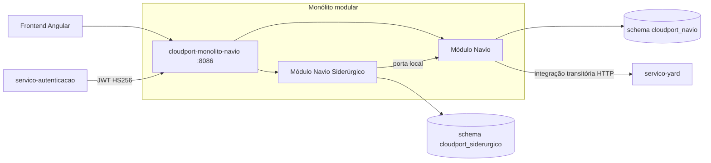

# CloudPort

O CloudPort é uma plataforma para operações portuárias, com módulos de navio, carga siderúrgica, pátio, gate, ferrovia, autenticação e visibilidade operacional.

## Diretriz arquitetural vigente

O backend está migrando de vários microsserviços implantáveis para um **monólito modular**.

A decisão significa:

- um único processo Spring Boot para os módulos já migrados;
- limites de domínio preservados por módulos, pacotes, portas e adaptadores;
- chamadas locais entre módulos que executam no mesmo processo;
- uma única configuração de segurança, observabilidade e execução por runtime;
- banco PostgreSQL compartilhado, mantendo inicialmente um schema e um histórico Flyway por módulo;
- HTTP e mensageria apenas para integrações externas ou módulos que ainda não foram incorporados.

Não devem ser criados novos microsserviços para funcionalidades internas do CloudPort sem uma decisão arquitetural explícita.

## Estado atual da migração

| Componente | Estado | Execução atual |
| --- | --- | --- |
| Navio | Incorporado | Módulo Maven carregado pelo `cloudport-monolito-navio` |
| Navio Siderúrgico | Incorporado | Módulo Maven carregado pelo `cloudport-monolito-navio` |
| Yard | Em transição | Deployment legado acessado pelo runtime de Navio |
| Gate | Em transição | Deployment legado |
| Rail | Em transição | Deployment legado |
| Autenticação | Em transição | Emissor de JWT ainda separado |
| Visibilidade | Em transição | Deployment legado |
| Frontend principal | Ativo | Aplicação Angular em `frontend/cloudport` |

Os diretórios `backend/servico-*` continuam existindo para preservar os limites dos módulos e permitir rollback durante a transição. O prefixo `servico-` não define a arquitetura alvo nem exige deployment separado.

## Arquitetura do primeiro corte consolidado


```mermaid
flowchart LR
    FE[Frontend Angular] --> API[cloudport-monolito-navio :8086]

    subgraph MONOLITO[Monólito modular]
        API --> NAVIO[Módulo Navio]
        API --> SIDERURGICO[Módulo Navio Siderúrgico]
        SIDERURGICO -->|porta local| NAVIO
    end

    NAVIO --> DBN[(schema cloudport_navio)]
    SIDERURGICO --> DBS[(schema cloudport_siderurgico)]
    NAVIO -->|integração transitória HTTP| YARD[servico-yard]
    AUTH[servico-autenticacao] -->|JWT HS256| API
```

A documentação detalhada está em [`docs/arquitetura-monolito-modular.md`](docs/arquitetura-monolito-modular.md).

## Estrutura relevante

```text
backend/
├── cloudport-navio-modules/       # reator Maven do corte consolidado
├── cloudport-monolito-navio/      # runtime Spring Boot único
├── servico-navio/                 # módulo de domínio Navio
├── servico-navio-siderurgico/     # módulo de domínio siderúrgico
├── servico-yard/                  # módulo/deployment legado em transição
├── servico-gate/                  # módulo/deployment legado em transição
├── servico-rail/                  # módulo/deployment legado em transição
├── servico-autenticacao/          # módulo/deployment legado em transição
└── servico-visibilidade/          # módulo/deployment legado em transição

frontend/
├── cloudport/                     # portal Angular principal
└── servico-navio-siderurgico/     # frontend legado durante a consolidação
```

## Compilar e testar o runtime consolidado

Pré-requisitos: JDK 17, Maven 3.9+ e Docker disponível para os testes com Testcontainers.

```bash
cd backend/cloudport-navio-modules

mvn -B -Pmodulo-monolito \
  -pl :servico-navio,:servico-navio-siderurgico \
  -DskipTests install

mvn -B -Pmodulo-monolito \
  -pl :cloudport-monolito-navio \
  test package
```

O build valida o runtime com PostgreSQL real, os dois schemas, os históricos Flyway independentes e os repositórios JPA dos módulos incorporados.

## Executar o runtime consolidado

Variáveis mínimas:

```bash
export MONOLITO_NAVIO_DB_URL='jdbc:postgresql://localhost:5432/cloudport'
export MONOLITO_NAVIO_DB_USERNAME='cloudport'
export MONOLITO_NAVIO_DB_PASSWORD='cloudport'
export JWT_SECRET='substitua-por-um-segredo-com-pelo-menos-32-bytes'
```

Variáveis opcionais ou transitórias:

```bash
export MONOLITO_NAVIO_SERVER_PORT='8086'
export MONOLITO_NAVIO_SCHEMA='cloudport_navio'
export MONOLITO_SIDERURGICO_SCHEMA='cloudport_siderurgico'
export YARD_SERVICE_URL='http://localhost:8081'
export CLOUDPORT_INTERNAL_SERVICE_KEY='chave-de-integracao-interna'
export SECURITY_CORS_ALLOWED_ORIGINS='http://localhost:4200,http://localhost:4201'
```

Após compilar:

```bash
java -jar backend/cloudport-monolito-navio/target/cloudport-monolito-navio-*.jar
```

Também é possível construir a imagem a partir da pasta `backend`:

```bash
cd backend
docker build -f cloudport-monolito-navio/Dockerfile -t cloudport-monolito-navio .
```

## Frontend

O portal principal usa uma única URL base configurada em tempo de execução por `frontend/cloudport/src/assets/configuracao.json`. Durante a migração, essa URL deve apontar para o proxy de entrada ou para o runtime consolidado, evitando URLs específicas de cada módulo no código Angular.

Consulte [`frontend/cloudport/README.md`](frontend/cloudport/README.md) para instalação, build e testes.

## Documentação de evolução

- Arquitetura e regras de migração: [`docs/arquitetura-monolito-modular.md`](docs/arquitetura-monolito-modular.md)
- Pendências: [`docs/requisitos/modulo-navios-back-front-gaps.md`](docs/requisitos/modulo-navios-back-front-gaps.md)
- Entregas concluídas: [`docs/implementados/requisitos-implementados.md`](docs/implementados/requisitos-implementados.md)
