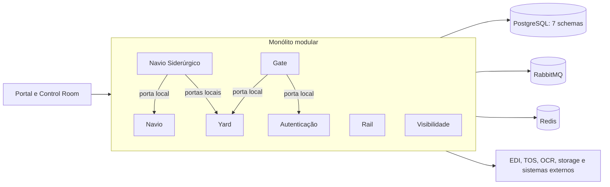

# CloudPort

O CloudPort é uma plataforma para operações portuárias com módulos de Navio, carga siderúrgica, Yard, Gate, Rail, Autenticação e Visibilidade.

## Arquitetura vigente

O backend alvo é um **monólito modular**:

- um processo Spring Boot e uma origem de API;
- limites de domínio preservados por módulos, pacotes, portas e eventos;
- chamadas locais entre módulos incorporados;
- segurança, CORS, Jackson, erros, logs, métricas, tracing e agendamento centralizados;
- PostgreSQL compartilhado, com schema e histórico Flyway próprios por módulo;
- HTTP e mensageria restritos a integrações externas ou ao período de rollback.

Não devem ser criados novos microsserviços para funcionalidades internas sem decisão arquitetural explícita.

## Estado da migração

| Componente | Estado no código | Estado operacional |
| --- | --- | --- |
| Navio | Incorporado | corte condicionado à validação de ambiente |
| Navio Siderúrgico | Incorporado | corte condicionado à validação de ambiente |
| Yard | Incorporado | deployment legado preservado para rollback |
| Gate | Incorporado | deployment legado preservado para rollback |
| Rail | Incorporado | deployment legado preservado para rollback |
| Autenticação | Incorporado | deployment e credenciais legadas preservados para rollback |
| Visibilidade | Incorporado | deployment legado preservado para rollback |
| Portal principal | React | consome uma origem de API configurável |
| Control Room | React incorporado | servido pelo runtime consolidado |

Os diretórios `backend/servico-*` representam módulos. Eles continuam compiláveis isoladamente durante a janela de retorno, mas não definem a arquitetura alvo.

## Visão do runtime


```mermaid
flowchart LR
    FE[Portal e Control Room] --> API[cloudport-monolito :8086]

    subgraph API[Monólito modular]
        AUTH[Autenticação]
        GATE[Gate]
        RAIL[Rail]
        YARD[Yard]
        NAVIO[Navio]
        SID[Navio Siderúrgico]
        VIS[Visibilidade]

        SID -->|porta local| NAVIO
        SID -->|portas locais| YARD
        GATE -->|porta local| YARD
        GATE -->|porta local| AUTH
    end

    API --> PG[(PostgreSQL: 7 schemas)]
    API --> MQ[(RabbitMQ)]
    API --> REDIS[(Redis)]
    API --> EXT[EDI, TOS, OCR, storage e sistemas externos]
```

## Estrutura relevante

```text
backend/
├── cloudport-navio-modules/       # parent e reator Maven
├── cloudport-monolito-navio/      # runtime Spring Boot único
├── servico-navio/
├── servico-navio-siderurgico/
├── servico-yard/
├── servico-gate/
├── servico-rail/
├── servico-autenticacao/
└── servico-visibilidade/

frontend/
├── cloudport/                     # portal principal React
└── servico-navio-siderurgico/     # Control Room React
```

## Compilar e testar

Pré-requisitos: JDK 17, Maven 3.9+ e Docker.

```bash
cd backend/cloudport-navio-modules
mvn -B -Pmodulo-monolito -pl :cloudport-monolito-navio -am test package
```

O build inclui os sete módulos e valida PostgreSQL/Testcontainers, históricos Flyway, segurança única, portas locais e regras ArchUnit.

## Executar

Variáveis mínimas:

```bash
export CLOUDPORT_DB_URL='jdbc:postgresql://localhost:5432/cloudport'
export CLOUDPORT_DB_USERNAME='cloudport'
export CLOUDPORT_DB_PASSWORD='cloudport'
export JWT_SECRET='substitua-por-segredo-com-pelo-menos-32-bytes'
```

Infraestrutura:

```bash
export SPRING_RABBITMQ_HOST='localhost'
export SPRING_REDIS_HOST='localhost'
```

Após compilar:

```bash
java -jar backend/cloudport-monolito-navio/target/cloudport-monolito-navio-*.jar
```

## Docker Compose

```bash
docker compose \
  -f deploy/navio-monolito/docker-compose.yml \
  --profile monolito \
  up -d --build
```

O perfil `legado` existe para comparação e rollback. Ele deve permanecer com escrita, jobs e consumidores desativados enquanto o monólito estiver ativo.

## Documentação

- Arquitetura: [`docs/arquitetura-monolito-modular.md`](docs/arquitetura-monolito-modular.md)
- Corte e rollback: [`docs/operacao-corte-rollback-navio.md`](docs/operacao-corte-rollback-navio.md)
- Runtime: [`backend/cloudport-monolito-navio/README.md`](backend/cloudport-monolito-navio/README.md)
- Pendências: [`docs/requisitos/modulo-navios-back-front-gaps.md`](docs/requisitos/modulo-navios-back-front-gaps.md)
- Entregas: [`docs/implementados/requisitos-implementados.md`](docs/implementados/requisitos-implementados.md)
