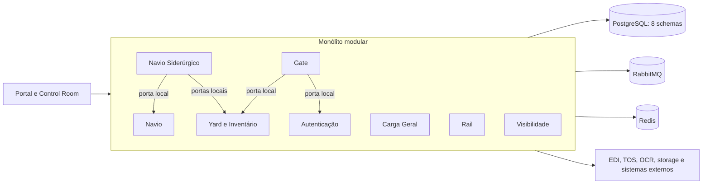

# CloudPort

O CloudPort é uma plataforma para operação portuária integrada, com módulos de Navio, Navio Siderúrgico, Carga Geral e Break-bulk, Yard, Inventário, Gate, Rail, Autenticação, Visibilidade e Control Room.

## Escopo funcional atual

### Navio e Vessel Planner

O domínio de Navio cobre cadastro canônico, escalas, itens operacionais, Bay Plan/BAPLIE, planejamento de estiva, integração com o Yard, reservas, ordens, work queues, plano de guindastes, Quay Monitor e produtividade de cais.

O Vessel Planner possui vistas `profile`, `top`, `section` e `tier` sincronizadas, inspector de slot, drag-and-drop da load list e entre slots, legendas por POD, peso, IMO, reefer e operador, tampas de porão, peso acumulado por stack, restrições visuais, segregação IMDG, restow, sequência de guindastes e overlays de estabilidade, lashing indicativo e força estrutural.

### Yard e Inventário

O Yard possui mapa georreferenciado, vistas de bloco, seção, scan e microvisão, heatmaps de ocupação e dwell time, workspaces salvos, movimentação gráfica com simulação, restrições e notas de pilha, rotas operacionais, allocations gráficas e telemetria de reefers com alarmes de temperatura e alimentação.

O inventário canônico unifica contêineres, chassis, carretas e acessórios, incluindo ciclo de vida, tipos, prefixos, dimensões, equivalências, lacres, documentos, avarias, condições, manutenção, holds, permissions, ownership, montagem de equipamentos, histórico, controle reefer, inventário físico e divergências.

### Gate

O Gate possui facilities, múltiplos gates e pistas, estágios e business tasks configuráveis, bookings, Bill of Lading, EDO, ERO, IDO, pré-avisos, appointments com capacidade, truck visits com múltiplas transações, trouble transactions, inspeções, imagens, documentos, tickets, EIR, transferências entre instalações e regras de acesso para motorista, transportadora e veículo.

A interface operacional apresenta quadro visual das pistas, filas por estágio, calendário e capacidade dos agendamentos, jornada do veículo, OCR, balança, inspeção, liberação, documentos, avarias, transações problemáticas, impressão e reimpressão de EIR e SLA por atendimento.

### Rail

O módulo ferroviário mantém visitas, composições, linhas e operações. A interface representa locomotivas e vagões em sequência, associa contêineres aos vagões, mostra progresso individual, ocupação de linhas, cronograma e conflitos e permite replanejamento visual de vagões. A persistência desse replanejamento visual continua registrada como evolução pendente.

### Carga Geral e Break-bulk

O domínio de Carga Geral cobre Bill of Lading, itens do conhecimento, cargo lots, commodities, embalagens, produtos, códigos de armazenagem e manuseio, mercadorias perigosas, faixas de temperatura, avarias, quantidade, volume, peso, estoque físico, carga e descarga parcial, transferência, consolidação, desconsolidação e vínculos com veículo, navio, armazém e cliente.

Bobinas de aço permanecem atendidas pelo módulo especializado de Navio Siderúrgico, sem limitar o sistema a carga conteinerizada ou siderúrgica.

### Control Room e grade operacional

O Control Room acompanha equipamentos, posição, conectividade, VMT, work instruction atual, histórico de telemetria, heartbeat, alarmes, indisponibilidades e comandos remotos. As atualizações usam Server-Sent Events, com polling somente como contingência nos fluxos que o exigem.

O `OperationalDataGrid` compartilhado oferece busca, ordenação, paginação, filtros, seleção múltipla, ações em lote, colunas configuráveis, inspector lateral e exportação CSV e Excel com proteção contra fórmulas maliciosas.

## Ponto de entrada canônico

O backend oficial é o monólito modular executado por `backend/cloudport-runtime`.

O diretório `backend/cloudport-monolito-navio` representa o primeiro corte do monólito e permanece disponível exclusivamente para rollback intermediário. Ele não deve ser usado em novos comandos de build, execução ou implantação principal.

A arquitetura vigente possui:

- um processo Spring Boot e uma origem de API;
- oito módulos de domínio incorporados;
- limites preservados por módulos, pacotes, portas e eventos internos;
- segurança, CORS, Jackson, erros, logs, métricas, tracing e agendamento centralizados;
- PostgreSQL compartilhado, com oito schemas e históricos Flyway independentes;
- RabbitMQ, Redis, TOS, OCR, EDI, storage e demais integrações somente na borda;
- serviços `backend/servico-*` preservados como módulos compiláveis durante a janela de rollback.

Não devem ser criados novos microsserviços para funcionalidades internas sem decisão arquitetural explícita.

## Estado dos componentes

| Componente | Estado no código | Estado operacional |
| --- | --- | --- |
| Autenticação | Incorporada ao `cloudport-runtime` | runtime canônico |
| Carga Geral | Incorporada ao `cloudport-runtime` | runtime canônico |
| Gate | Incorporado ao `cloudport-runtime` | runtime canônico |
| Rail | Incorporado ao `cloudport-runtime` | runtime canônico |
| Visibilidade | Incorporada ao `cloudport-runtime` | runtime canônico |
| Yard e Inventário | Incorporados ao `cloudport-runtime` | runtime canônico |
| Navio | Incorporado ao `cloudport-runtime` | runtime canônico |
| Navio Siderúrgico | Incorporado ao `cloudport-runtime` | runtime canônico |
| Portal principal | React | consome uma origem configurável |
| Control Room | React | integrado ao portal e ao runtime |
| `cloudport-monolito-navio` | preservado | rollback intermediário somente |

## Visão do runtime


```mermaid
flowchart LR
    FE[Portal e Control Room] --> API[cloudport-runtime :8080]

    subgraph API[Monólito modular]
        AUTH[Autenticação]
        CGO[Carga Geral]
        GATE[Gate]
        RAIL[Rail]
        VIS[Visibilidade]
        YARD[Yard e Inventário]
        NAVIO[Navio]
        SID[Navio Siderúrgico]

        SID -->|porta local| NAVIO
        SID -->|portas locais| YARD
        GATE -->|porta local| YARD
        GATE -->|porta local| AUTH
    end

    API --> PG[(PostgreSQL: 8 schemas)]
    API --> MQ[(RabbitMQ)]
    API --> REDIS[(Redis)]
    API --> EXT[EDI, TOS, OCR, storage e sistemas externos]
```

## Estrutura relevante

```text
backend/
├── cloudport-modules/             # reator Maven canônico
├── cloudport-contracts/           # contratos compartilhados
├── cloudport-runtime/             # ponto de entrada Spring Boot canônico
├── cloudport-monolito-navio/      # runtime anterior, somente rollback
├── servico-autenticacao/
├── servico-carga-geral/
├── servico-gate/
├── servico-rail/
├── servico-visibilidade/
├── servico-yard/
├── servico-navio/
└── servico-navio-siderurgico/

frontend/
├── cloudport/                     # portal principal React
├── Dockerfile                    # imagem Node 22 + Nginx
└── nginx.conf                    # SPA, cache e health check
```

## Compilar e testar

Pré-requisitos: JDK 17, Maven 3.9+ e Docker.

```bash
cd backend/cloudport-modules
mvn -B -N -f ../cloudport-navio-modules/pom.xml -DskipTests install
mvn -B -Dspring-boot.repackage.skip=true \
  -pl :cloudport-runtime -am \
  -DskipTests install
mvn -B -pl :cloudport-runtime test package
```

O build inclui os oito módulos, `cloudport-contracts` e o runtime. A validação cobre PostgreSQL/Testcontainers, históricos Flyway, segurança única, portas locais e regras ArchUnit.

## Executar o backend

Variáveis mínimas do runtime:

```bash
export SPRING_DATASOURCE_URL='jdbc:postgresql://localhost:5432/cloudport'
export SPRING_DATASOURCE_USERNAME='cloudport'
export SPRING_DATASOURCE_PASSWORD='cloudport'
export CLOUDPORT_SECURITY_JWT_SECRET='substitua-por-segredo-com-pelo-menos-32-bytes'
export CLOUDPORT_SECURITY_JWT_EXPIRATION='PT2H'
export SPRING_RABBITMQ_HOST='localhost'
export SPRING_RABBITMQ_USERNAME='cloudport'
export SPRING_RABBITMQ_PASSWORD='cloudport'
export SPRING_REDIS_HOST='localhost'
export SPRING_REDIS_PORT='6379'
```

Após compilar:

```bash
java -jar backend/cloudport-runtime/target/cloudport-runtime-*.jar
```

## Docker Compose

```bash
export POSTGRES_PASSWORD='substitua-a-senha-do-postgres'
export RABBITMQ_PASSWORD='substitua-a-senha-do-rabbitmq'
export JWT_SECRET='substitua-por-segredo-com-pelo-menos-32-bytes'
export CLOUDPORT_INTERNAL_SERVICE_KEY='substitua-a-chave-interna'
export SECURITY_CORS_ALLOWED_ORIGINS='http://localhost:4200,http://localhost:8080'
export TOS_API_BASE_URL='http://localhost:8090'

docker compose \
  -f deploy/cloudport-runtime/docker-compose.yml \
  up -d --build
```

A origem padrão da API é `http://localhost:8080`.

## Implantação no EasyPanel

### Backend

- repositório: `diogo2806/CloudPort`;
- branch: `main`;
- caminho de build: `/backend`;
- arquivo: `Dockerfile`;
- porta: `8080`;
- health check: `/actuator/health/readiness`.

O contexto `/backend` deve usar `backend/Dockerfile`. O arquivo `backend/cloudport-runtime/Dockerfile` é destinado ao build iniciado pela raiz do repositório.

### Frontend

- repositório: `diogo2806/CloudPort`;
- branch: `main`;
- caminho de build: `/frontend`;
- arquivo: `Dockerfile`;
- porta: `80`;
- health check: `/health`.

A imagem compila `frontend/cloudport` com Node 22 e publica `dist/cloudport` em Nginx, com fallback de SPA para `index.html`.

## Rollback

O runtime anterior exige `CLOUDPORT_ROLLBACK_ENABLED=true` e possui implementações locais para as portas obrigatórias do Yard. A execução direta permanece desativada por padrão.

Use o runbook antes de iniciar `backend/cloudport-monolito-navio` ou o Compose em `deploy/navio-monolito`.

## Documentação

- Arquitetura: [`docs/arquitetura-monolito-modular.md`](docs/arquitetura-monolito-modular.md)
- Corte e rollback: [`docs/operacao-corte-rollback-navio.md`](docs/operacao-corte-rollback-navio.md)
- Runtime canônico: [`backend/cloudport-runtime/README.md`](backend/cloudport-runtime/README.md)
- Gate operacional: [`docs/modulos/gate-operacional-completo.md`](docs/modulos/gate-operacional-completo.md)
- Runtime anterior de rollback: [`backend/cloudport-monolito-navio/README.md`](backend/cloudport-monolito-navio/README.md)
- Pendências funcionais: [`docs/requisitos/modulo-navios-back-front-gaps.md`](docs/requisitos/modulo-navios-back-front-gaps.md)
- Pendências técnicas: [`docs/requisitos/requisito-tecnico.md`](docs/requisitos/requisito-tecnico.md)
- Entregas: [`docs/implementados/requisitos-implementados.md`](docs/implementados/requisitos-implementados.md)
