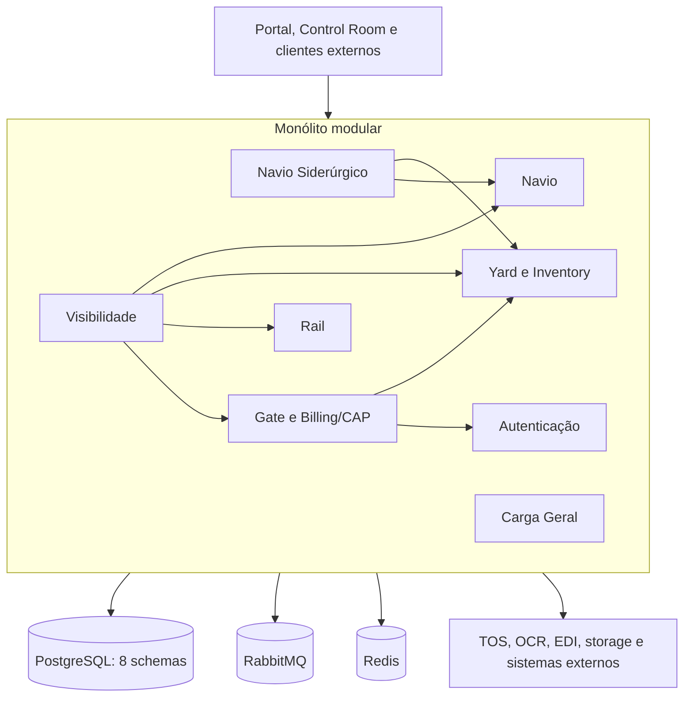

# Arquitetura do monólito modular CloudPort

Atualizado em 2026-07-18 com o estado da `main` após as entregas de Carga Geral, Inventory Management, Gate operacional, Control Room, Yard, Vessel Planner, Billing/CAP e implantação no EasyPanel.

## Status da decisão

- Estado: vigente.
- Arquitetura alvo: monólito modular.
- Runtime geral: `backend/cloudport-runtime`.
- Primeiro corte preservado para rollback: `backend/cloudport-monolito-navio`.
- Módulos incorporados: Autenticação, Carga Geral, Gate, Rail, Visibilidade, Yard, Navio e Navio Siderúrgico.

Este documento é a referência principal para estrutura, comunicação, persistência, segurança, build, implantação e rollback do backend.

## Decisão

O CloudPort executa suas funcionalidades internas em um único processo Spring Boot, mantendo limites explícitos entre os módulos de negócio.

O runtime geral possui:

1. um artefato e um processo para o backend;
2. oito módulos Maven com responsabilidade e dependências explícitas;
3. comunicação local por portas, serviços de aplicação e eventos internos;
4. contratos HTTP preservados na borda para frontend e integrações externas;
5. segurança, CORS, OpenAPI, cache, banco e infraestrutura transversal centralizados;
6. persistência compartilhada com ownership de tabelas e schemas por módulo;
7. possibilidade de rollback enquanto os deployments antigos ainda existirem.

## Estado implementado

| Capacidade | Estado |
| --- | --- |
| Processo Spring Boot único | implementado em `cloudport-runtime` |
| Autenticação | incorporada, com emissão e validação por componentes internos |
| Carga Geral | incorporada, incluindo Bill of Lading, itens, lotes e estoque |
| Gate | incorporado, incluindo configuração, execução, inspeções, documentos e Billing/CAP |
| Rail | incorporado |
| Visibilidade | incorporada |
| Yard | incorporado, incluindo inventário canônico, reservas, work queues e telemetria |
| Navio | incorporado |
| Navio Siderúrgico | incorporado |
| Navio Siderúrgico → Navio | chamada local por `CadastroNavioPorta` |
| Navio → Yard | chamadas locais para ordens, work queues, posições e otimização |
| Gate → Autenticação | consulta local de usuário |
| Gate → Yard | consulta local de disponibilidade e status |
| TOS | adaptador HTTP externo |
| OCR | integração RabbitMQ externa |
| EDI | processamento interno com canais externos de entrada e saída |
| RabbitMQ e Redis | infraestrutura externa |
| PostgreSQL | uma conexão, oito schemas proprietários |
| Flyway | um histórico independente por módulo |
| Segurança e CORS | uma configuração do runtime consolidado |
| OpenAPI | um documento consolidado |
| Teste de contexto | PostgreSQL 16 por Testcontainers |
| Imagem e Compose | implementados para o runtime geral |
| EasyPanel | Dockerfiles específicos para os contextos `/backend` e `/frontend` |
| Retirada dos deployments antigos | depende de corte operacional e rollback validado |

## Visão de execução



As setas internas representam chamadas locais ou eventos internos. HTTP e mensageria permanecem na borda quando a integração atravessa o processo.

## Limites dos módulos

Cada módulo deve:

- possuir pacote raiz próprio;
- expor operações internas por interfaces ou serviços de aplicação pequenos;
- não acessar controller, repository ou entidade JPA de outro módulo;
- não consultar diretamente o schema de outro módulo para substituir um contrato interno;
- não introduzir dependência cíclica;
- possuir e versionar suas próprias migrações;
- publicar evento interno quando a dependência síncrona não for necessária.

### Responsabilidades

| Módulo | Responsabilidade principal |
| --- | --- |
| Autenticação | login, emissão de JWT, usuários, papéis, permissões e navegação |
| Carga Geral | Bill of Lading, itens, cargo lots, referências, estoque, movimentações e avarias |
| Gate | facilities, gates, lanes, appointments, truck visits, transações, documentos, inspeções, Billing e CAP |
| Rail | visitas ferroviárias, composições, ordens e operações ferroviárias |
| Visibilidade | dashboards, histórico, alertas, projeções e central operacional |
| Yard | mapa, posições, inventário, reservas, ordens, allocations, work queues, work instructions, reefers e CHEs |
| Navio | cadastro canônico, escalas, line-up, Bay Plan, crane plan e estiva |
| Navio Siderúrgico | visitas operacionais, itens, reservas, integração com Yard e regras siderúrgicas |
| Integrações | TOS, OCR, EDI, webhooks, storage e mensageria externa |

## Comunicação

### Permitido internamente

- chamada direta por porta/interface ou serviço público do módulo proprietário;
- DTO interno estável, sem expor entidade JPA;
- evento interno no mesmo processo;
- transação coordenada somente quando a operação for realmente atômica.

### Permitido na borda

- HTTP para TOS e outros sistemas externos;
- RabbitMQ para OCR, interoperabilidade e eventos externos;
- Redis para cache e projeções;
- storage local, objeto ou serviço externo por adaptador;
- SSE e WebSocket autenticados para atualização operacional do frontend.

### Transitório para rollback

- clientes HTTP legados condicionados por propriedade;
- `X-CloudPort-Service-Key` somente quando a chamada atravessar deployments antigos;
- imagens e configurações dos runtimes anteriores enquanto o rollback não tiver sido encerrado.

### Não permitido para código novo

- cliente HTTP entre módulos que executam no `cloudport-runtime`;
- compartilhamento de repository JPA;
- acesso direto à entidade interna de outro módulo;
- novo executável Spring Boot para funcionalidade interna sem nova decisão arquitetural;
- duplicação de segurança, CORS ou OpenAPI no runtime geral.

## Persistência e Flyway

O runtime usa uma conexão PostgreSQL e preserva ownership por schema:

| Schema | Módulo proprietário |
| --- | --- |
| `cloudport_autenticacao` | Autenticação |
| `cloudport_carga_geral` | Carga Geral |
| `cloudport_gate` | Gate, Billing e CAP |
| `cloudport_rail` | Rail |
| `cloudport_visibilidade` | Visibilidade |
| `cloudport_yard` | Yard e Inventory Management |
| `cloudport_navio` | Navio |
| `cloudport_siderurgico` | Navio Siderúrgico |

O runtime cria oito objetos Flyway independentes antes do `EntityManagerFactory`. Cada histórico utiliza somente as migrações do artefato proprietário.

Regras:

1. uma versão Flyway não pode ser reutilizada dentro do mesmo módulo;
2. migrações aplicadas não devem ser alteradas;
3. mudanças de compatibilidade usam `expand and contract`;
4. remoções destrutivas não podem ocorrer na mesma entrega que retira o deployment antigo;
5. joins entre schemas não substituem contratos de módulo;
6. nomes de schema são validados antes do uso.

## Segurança

O runtime geral:

- expõe uma única `SecurityFilterChain`;
- valida JWT HS256 e converte claims de papéis para autoridades Spring;
- mantém a aplicação stateless;
- centraliza CORS;
- libera somente autenticação, health, documentação e assets públicos necessários;
- mantém o filtro de credencial interna apenas para compatibilidade com deployments legados;
- exige segredo JWT com no mínimo 32 bytes;
- publica um único OpenAPI consolidado.

As exceções técnicas ainda abertas, incluindo a proteção da execução standalone de Carga Geral, sanitização dos logs do TOS e autorização dos canais WebSocket do Yard, estão registradas em `docs/requisitos/requisito-tecnico.md`.

## Cache, mensageria e integrações

O cache do runtime combina Caffeine para contratos TOS do Gate e Redis para projeções da Visibilidade.

RabbitMQ permanece externo porque representa OCR, interoperabilidade, EDI e eventos publicados. Incorporar o módulo não transforma automaticamente esses contratos externos em chamadas diretas.

Durante o corte, somente uma instância pode consumir cada fila e executar cada job. Deployments antigos devem iniciar com consumidores, jobs e escrita desativados.

## Build

O runtime geral é construído pelo parent compartilhado e pelo reator:

```text
backend/cloudport-navio-modules
backend/cloudport-modules
├── cloudport-contracts
├── servico-autenticacao
├── servico-carga-geral
├── servico-gate
├── servico-rail
├── servico-visibilidade
├── servico-yard
├── servico-navio
├── servico-navio-siderurgico
└── cloudport-runtime
```

Comandos:

```bash
cd backend/cloudport-modules
mvn -B -N -f ../cloudport-navio-modules/pom.xml -DskipTests install
mvn -B -Dspring-boot.repackage.skip=true \
  -pl :cloudport-runtime -am \
  -DskipTests install
mvn -B -pl :cloudport-runtime test package
```

O `backend/cloudport-runtime/Dockerfile` usa a raiz do repositório como contexto. O `backend/Dockerfile` usa `/backend` como contexto e é o arquivo destinado ao EasyPanel.

## Implantação

### Docker Compose

O Compose em `deploy/cloudport-runtime/docker-compose.yml` inicia PostgreSQL, RabbitMQ, Redis e `cloudport-runtime`.

O runtime geral é o único escritor e executor de jobs no perfil consolidado. O proxy ou frontend deve usar uma única origem de API.

### EasyPanel

Backend:

- caminho de build `/backend`;
- arquivo `Dockerfile`;
- porta `8080`;
- health `/actuator/health/readiness`.

Frontend:

- caminho de build `/frontend`;
- arquivo `Dockerfile`;
- porta `80`;
- health `/health`.

O frontend é compilado com Node 22 e servido por Nginx com fallback de SPA.

### Critérios para retirar os deployments antigos

1. paridade dos endpoints usados;
2. autenticação e autorização validadas;
3. migrações e dados compatíveis;
4. somente uma execução de jobs e consumidores;
5. frontend e integrações externas testados;
6. health, logs, métricas e alertas disponíveis;
7. testes unitários, integração, contrato e e2e aprovados;
8. proxy apontando para o runtime geral;
9. rollback testado;
10. branch sincronizada e sem conflitos.

## Rollback

Enquanto os deployments antigos existirem, o rollback deve:

1. interromper o runtime geral antes de reativar escrita, jobs ou consumidores antigos;
2. preservar schemas e históricos Flyway compatíveis;
3. redirecionar a origem de API para o deployment anterior;
4. reativar variáveis e adaptadores legados documentados;
5. impedir escrita concorrente entre os dois modelos;
6. não tentar desfazer migração aditiva já aplicada.

O `cloudport-monolito-navio` pode ser utilizado como rollback intermediário do domínio Navio. A retirada definitiva dele e dos serviços antigos ocorrerá somente após a estabilização do runtime geral.

## Pendências arquiteturais atuais

- executar e testar o corte operacional do runtime geral nos ambientes;
- comprovar paridade e e2e dos fluxos críticos antes de remover deployments antigos;
- remover clientes, imagens e credenciais legadas somente após encerrar a janela de rollback;
- renomear artefatos `servico-*` somente após estabilização dos pipelines;
- concluir as pendências técnicas registradas em `docs/requisitos/requisito-tecnico.md`.
