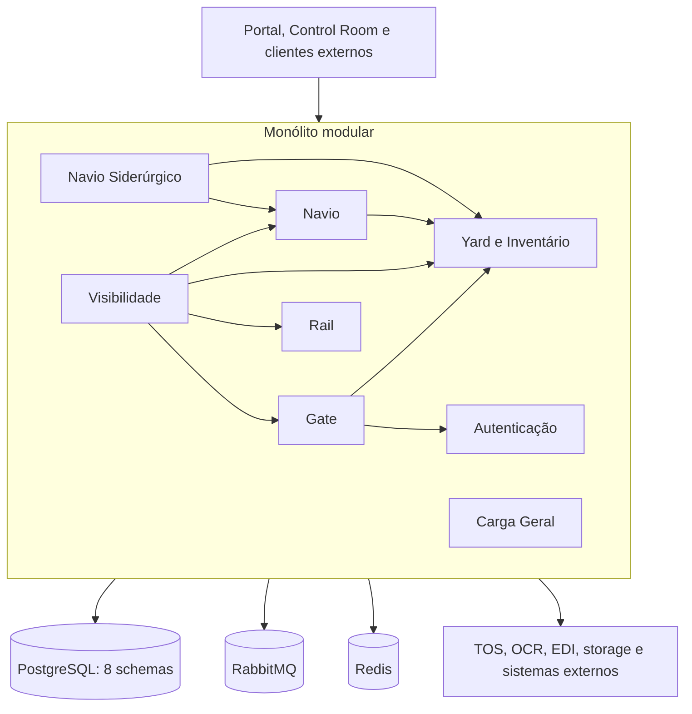

# Arquitetura do monólito modular CloudPort

## Status da decisão

- Estado: vigente.
- Arquitetura alvo: monólito modular.
- Runtime geral: `backend/cloudport-runtime`.
- Primeiro corte preservado para rollback: `backend/cloudport-monolito-navio`.
- Módulos incorporados: Autenticação, Carga Geral, Gate, Rail, Visibilidade, Yard, Navio e Navio Siderúrgico.

Este documento é a referência para estrutura, comunicação, persistência, segurança, build, implantação e rollback do backend.

## Decisão

O CloudPort executa suas funcionalidades internas em um único processo Spring Boot, mantendo limites explícitos entre os módulos de negócio.

O runtime geral possui:

1. um artefato executável e um processo para o backend;
2. oito módulos Maven de domínio, mais o artefato de contratos compartilhados;
3. comunicação local por portas, serviços de aplicação e eventos internos;
4. contratos HTTP preservados na borda para frontend e integrações externas;
5. segurança, CORS, OpenAPI, conexão PostgreSQL, Flyway e infraestrutura transversal centralizados;
6. persistência compartilhada com ownership de tabelas e schemas por módulo;
7. RabbitMQ, Redis, TOS, OCR, EDI, storage e webhooks tratados como integrações externas;
8. rollback preservado enquanto os deployments anteriores permanecerem compatíveis.

## Estado implementado

| Capacidade | Estado |
| --- | --- |
| Processo Spring Boot único | implementado em `cloudport-runtime` |
| Autenticação | incorporada; login, JWT, usuários, papéis e navegação |
| Carga Geral | incorporada; BL, itens, lotes, estoque e movimentações |
| Gate | incorporado; configuração, execução, documentos e painel operacional |
| Rail | incorporado; visitas, composição, linhas e operações |
| Visibilidade | incorporada; dashboards, alertas e projeções |
| Yard | incorporado; mapa, reservas, work queues, telemetria e allocations |
| Inventário canônico | incorporado ao módulo Yard |
| Navio | incorporado; cadastro, escalas, Bay Plan e Vessel Planner |
| Navio Siderúrgico | incorporado; regras e operação especializada |
| Navio Siderúrgico → Navio | chamada local por porta |
| Navio/Navio Siderúrgico → Yard | chamadas locais para posições, reservas, ordens, work queues e otimização |
| Gate → Autenticação | consulta local de usuário |
| Gate → Yard | consulta local de disponibilidade e status |
| TOS | adaptador HTTP externo |
| OCR e EDI | mensageria e adaptadores externos |
| PostgreSQL | uma conexão e oito schemas |
| Flyway | um histórico independente por módulo |
| Segurança e CORS | uma configuração canônica do runtime |
| OpenAPI | um documento consolidado |
| Teste de contexto | PostgreSQL 16 por Testcontainers |
| Imagens Docker | raiz, contexto `/backend` e frontend `/frontend` |
| Retirada dos deployments antigos | pendente de corte operacional e rollback validado |

## Visão de execução



As setas internas representam chamadas locais ou eventos internos. HTTP e mensageria permanecem na borda quando a integração atravessa o processo.

## Limites dos módulos

Cada módulo deve:

- possuir pacote raiz próprio;
- expor operações internas por portas ou serviços de aplicação pequenos;
- não acessar controller, repository ou entidade JPA de outro módulo;
- não consultar diretamente o schema de outro módulo para substituir contrato interno;
- não introduzir dependência cíclica;
- possuir e versionar suas próprias migrações;
- publicar evento interno quando a dependência síncrona não for necessária;
- continuar compilável isoladamente apenas enquanto a estratégia de rollback exigir.

### Responsabilidades

| Módulo | Responsabilidade principal |
| --- | --- |
| Autenticação | login, JWT, usuários, papéis, permissões e navegação |
| Carga Geral | Bill of Lading, itens, cargo lots, referências, estoque e movimentações |
| Gate | gates, pistas, estágios, appointments, truck visits, transações, inspeções e documentos |
| Rail | visitas ferroviárias, composições, linhas, vagões, ordens e operações |
| Visibilidade | dashboards, histórico, alertas e projeções de leitura |
| Yard | mapa, posições, reservas, ordens, work queues, work instructions, CHEs e reefers |
| Inventário, dentro do Yard | unidades, equipamentos, ciclo de vida, condição, avarias, holds e inventário físico |
| Navio | cadastro canônico, escalas, Bay Plan, estiva, guindastes e produtividade |
| Navio Siderúrgico | operação e planejamento especializado de carga siderúrgica |
| Integrações | TOS, OCR, EDI, webhooks, storage e mensageria externa |

## Comunicação

### Permitido internamente

- chamada direta por porta/interface ou serviço público do módulo proprietário;
- DTO interno estável, sem expor entidade JPA;
- evento interno no mesmo processo;
- transação coordenada somente quando a operação for realmente atômica.

### Permitido na borda

- HTTP para TOS e outros sistemas externos;
- RabbitMQ para OCR, EDI, interoperabilidade e eventos externos;
- Redis para cache e projeções;
- storage local, objeto ou serviço externo por adaptador;
- SSE e WebSocket autenticados para atualização de interfaces operacionais.

### Transitório para rollback

- clientes HTTP legados condicionados por propriedade;
- `X-CloudPort-Service-Key` somente quando a chamada atravessar deployments antigos ou integrar dispositivo autorizado;
- imagens e configurações dos runtimes anteriores enquanto a janela de rollback não tiver sido encerrada.

### Não permitido para código novo

- cliente HTTP entre módulos executados no `cloudport-runtime`;
- compartilhamento de repository JPA;
- acesso direto à entidade interna de outro módulo;
- novo executável Spring Boot para funcionalidade interna sem decisão arquitetural;
- duplicação de segurança, CORS, OpenAPI, tratamento de erro ou infraestrutura transversal no runtime geral.

## Persistência e Flyway

O runtime usa uma conexão PostgreSQL e preserva ownership por schema:

| Schema | Módulo proprietário |
| --- | --- |
| `cloudport_autenticacao` | Autenticação |
| `cloudport_carga_geral` | Carga Geral |
| `cloudport_gate` | Gate |
| `cloudport_rail` | Rail |
| `cloudport_visibilidade` | Visibilidade |
| `cloudport_yard` | Yard e Inventário |
| `cloudport_navio` | Navio |
| `cloudport_siderurgico` | Navio Siderúrgico |

O runtime cria oito objetos Flyway independentes antes do `EntityManagerFactory`. Cada histórico utiliza somente as migrações do artefato proprietário.

Regras:

1. uma versão Flyway não pode ser reutilizada dentro do mesmo módulo;
2. migrações aplicadas não podem ser alteradas;
3. mudanças compatíveis usam `expand and contract`;
4. remoções destrutivas não ocorrem na mesma entrega que retira o deployment anterior;
5. joins entre schemas não substituem contratos de módulo;
6. nomes de schema são validados antes do uso;
7. novas tabelas devem ser criadas no schema do módulo proprietário;
8. rollback troca binário e roteamento, sem downgrade automático de banco.

## Segurança

O runtime geral:

- expõe uma única `SecurityFilterChain` canônica;
- valida JWT HS256 e converte claims de papéis para autoridades Spring;
- mantém a aplicação stateless;
- centraliza CORS;
- libera somente autenticação, health, documentação e assets públicos necessários;
- mantém credencial interna apenas para integrações autorizadas e compatibilidade transitória;
- exige segredo JWT com pelo menos 32 bytes;
- publica um OpenAPI consolidado;
- aplica autorização por perfil antes dos comandos persistentes.

A execução standalone preservada de qualquer módulo deve manter paridade de autenticação e autorização. A proteção do runtime não deve ser usada como justificativa para expor um executável isolado sem segurança.

## Cache, mensageria e streaming

- Caffeine atende contratos TOS do Gate.
- Redis atende projeções e cache de Visibilidade.
- RabbitMQ permanece externo para OCR, EDI e eventos publicados.
- SSE é usado no Control Room para telemetria e atualizações operacionais.
- WebSocket/STOMP do Yard deve exigir autenticação, origem permitida e autorização por tópico.

Durante o corte, somente uma instância pode consumir cada fila e executar cada job. Deployments anteriores devem iniciar com consumidores, jobs e escrita desativados.

## Build

O reator canônico inclui:

```text
backend/cloudport-modules
├── cloudport-contracts
├── servico-autenticacao
├── servico-carga-geral
├── servico-gate
├── servico-rail
├── servico-visibilidade
├── servico-yard
├── servico-navio
├── servico-navio-siderurgico
└── cloudport-runtime
```

Comandos:

```bash
cd backend/cloudport-modules
mvn -B -N -f ../cloudport-navio-modules/pom.xml -DskipTests install
mvn -B -Dspring-boot.repackage.skip=true \
  -pl :cloudport-runtime -am \
  -DskipTests install
mvn -B -pl :cloudport-runtime test package
```

As imagens Docker suportadas são:

- `backend/Dockerfile`, quando o contexto é `/backend`;
- `backend/cloudport-runtime/Dockerfile`, quando o build começa na raiz;
- `frontend/Dockerfile`, quando o contexto é `/frontend`.

## Configuração obrigatória do backend

O runtime consolidado recebe:

- `DB_HOST`, `DB_PORT`, `DB_NAME`, `DB_USER` e `DB_PASS`;
- `DB_SCHEMA`, com os oito schemas separados por vírgulas;
- `SECURITY_JWT_SECRET` e `SECURITY_JWT_EXPIRATION_MS`;
- `ADMIN_EMAIL` e `ADMIN_PASSWORD`.

RabbitMQ, Redis, TOS, alertas, armazenamento e demais integrações mantêm variáveis específicas.

## Implantação

### Docker Compose

O Compose `deploy/cloudport-runtime/docker-compose.yml` inicia PostgreSQL, RabbitMQ, Redis e `cloudport-runtime`. O backend canônico é o único escritor e executor de jobs no perfil consolidado.

### EasyPanel

Backend:

- contexto `/backend`;
- `Dockerfile`;
- porta `8080`;
- health `/actuator/health/readiness`.

Frontend:

- contexto `/frontend`;
- `Dockerfile`;
- porta `80`;
- health `/health`.

O proxy e o frontend devem usar uma única origem de API.

## Critérios para retirar deployments antigos

1. paridade dos endpoints usados;
2. autenticação e autorização validadas;
3. migrações e dados compatíveis nos oito schemas;
4. somente uma execução de jobs e consumidores;
5. frontend e integrações externas testados;
6. health, logs, métricas e alertas disponíveis;
7. smokes dos oito módulos aprovados;
8. proxy apontando para o runtime geral;
9. rollback testado;
10. branch sincronizada e sem conflitos.

## Rollback

Enquanto os deployments antigos existirem, o rollback deve:

1. interromper o runtime geral antes de reativar escrita, jobs ou consumidores antigos;
2. preservar schemas e históricos Flyway compatíveis;
3. redirecionar a origem de API para o deployment anterior;
4. reativar variáveis e adaptadores legados documentados;
5. impedir escrita concorrente entre os modelos;
6. não desfazer migração aditiva já aplicada.

O `cloudport-monolito-navio` é apenas rollback intermediário. Serviços isolados são a última camada de retorno durante a janela de compatibilidade.

## Pendências arquiteturais atuais

- executar e testar o corte operacional do runtime geral;
- completar o smoke integrado com PostgreSQL, RabbitMQ, Redis e os oito módulos;
- eliminar configurações transversais duplicadas ainda existentes nos módulos;
- remover clientes e credenciais HTTP legados após encerrar o rollback;
- garantir segurança equivalente nos executáveis standalone preservados;
- proteger os canais WebSocket operacionais do Yard;
- renomear artefatos `servico-*` somente após estabilização dos pipelines.
