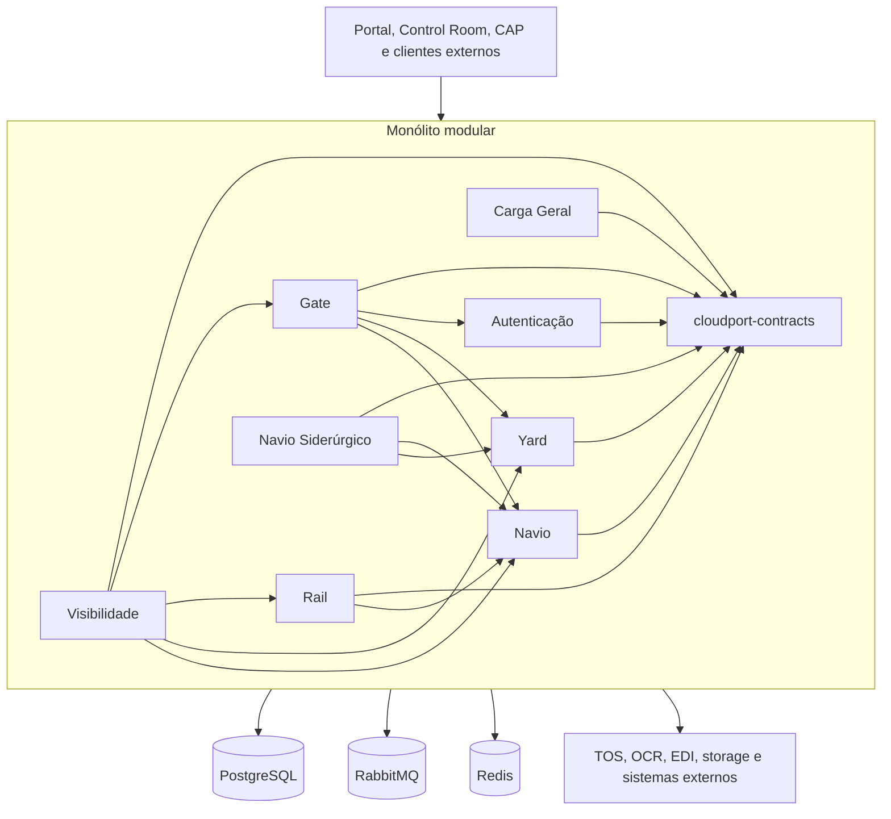

# Arquitetura do monólito modular CloudPort

## Status da decisão

- Estado: vigente.
- Arquitetura alvo: monólito modular.
- Runtime canônico: `backend/cloudport-runtime`.
- Reator Maven: `backend/cloudport-modules`.
- Contratos compartilhados: `backend/cloudport-contracts`.
- Primeiro corte preservado para rollback: `backend/cloudport-monolito-navio`.
- Módulos incorporados: Autenticação, Carga Geral, Gate, Rail, Visibilidade, Yard, Navio e Navio Siderúrgico.

Este documento é a referência principal para estrutura, comunicação, persistência, segurança, build, implantação e rollback do backend.

## Decisão

O CloudPort executa as funcionalidades internas em um único processo Spring Boot, preservando limites explícitos entre módulos de negócio.

O runtime geral possui:

1. um artefato executável e um processo para o backend;
2. módulos Maven com responsabilidade e dependências explícitas;
3. contratos compartilhados sem compartilhamento de entidades JPA;
4. comunicação local por portas, serviços de aplicação e eventos internos;
5. contratos HTTP preservados na borda para frontend e integrações externas;
6. segurança, CORS, OpenAPI, cache, banco e infraestrutura transversal centralizados;
7. persistência compartilhada com ownership de tabelas e schemas por módulo;
8. possibilidade de rollback enquanto os deployments anteriores permanecerem suportados.

## Estado implementado

| Capacidade | Estado |
| --- | --- |
| Processo Spring Boot único | Implementado em `cloudport-runtime` |
| Contratos compartilhados | Implementado em `cloudport-contracts` e incluído no reator Maven |
| Autenticação | Incorporada; emissão e validação permanecem componentes internos separados |
| Carga Geral | Incorporada, com schema e Flyway próprios |
| Gate | Incorporado |
| Rail | Incorporado |
| Visibilidade | Incorporada |
| Yard | Incorporado |
| Navio | Incorporado |
| Navio Siderúrgico | Incorporado |
| Navio Siderúrgico → Navio | Chamada local por porta canônica |
| Navio → Yard | Chamadas locais para ordens, work queues, reservas e posições |
| Gate → Autenticação | Consulta local de usuário |
| Gate → Yard | Consulta local de disponibilidade e integrações operacionais |
| Rail → Navio | Porta local para transferência intermodal de locomotiva |
| Gate → Navio | Porta local para embarque direto de contêiner |
| TOS | Adaptador HTTP externo |
| OCR | Adaptador RabbitMQ externo |
| EDI | Processamento persistente, idempotente e assíncrono na borda |
| RabbitMQ e Redis | Infraestrutura externa |
| PostgreSQL | Uma conexão, oito schemas |
| Flyway | Um histórico independente por módulo |
| Segurança e CORS | Uma configuração do runtime |
| OpenAPI | Um documento consolidado |
| Cache | Gerenciador composto para os módulos que exigem cache local ou Redis |
| Teste de contexto | PostgreSQL por Testcontainers; cenários adicionais com infraestrutura real permanecem no backlog técnico |
| Imagens Docker | Build pela raiz e pelo contexto `/backend` do EasyPanel |
| Frontend | Imagem Node/Nginx no contexto `/frontend` |
| Retirada dos deployments antigos | Pendente de corte operacional e rollback validado |

## Visão de execução



As setas internas representam chamadas locais ou eventos internos. HTTP e mensageria são mantidos na borda quando a integração atravessa o processo.

## Limites dos módulos

Cada módulo deve:

- possuir pacote raiz próprio;
- expor operações internas por interfaces pequenas e estáveis;
- utilizar DTOs ou contratos compartilhados, sem expor entidade JPA;
- não acessar controller, repository ou entidade de outro módulo;
- não consultar diretamente o schema de outro módulo como substituto de um contrato;
- não introduzir dependência cíclica;
- possuir e versionar suas próprias migrações;
- publicar evento interno quando a dependência síncrona não for necessária;
- manter autorização no ponto de entrada e validação no domínio proprietário.

### Responsabilidades

| Módulo | Responsabilidade principal |
| --- | --- |
| Autenticação | Login, JWT, usuários, papéis, permissões e navegação dinâmica |
| Carga Geral | Bill of Lading, itens, cargo lots, referências, estoque, avarias, movimentações, consolidação e break-bulk |
| Gate | Agendamentos, visitas, transações, pistas, estágios, documentos, inspeções, EIR, acessos e integrações de Gate |
| Rail | Visitas ferroviárias, composições, vagões, manifestos, ordens, line-up e transferência intermodal |
| Visibilidade | Dashboards, histórico, alertas, projeções, central global e eventos externos de leitura |
| Yard | Mapa, inventário, posições, reservas, allocations, ordens, work queues, work instructions e otimização |
| Navio | Cadastro canônico, escalas, line-up, modelos de navio, estiva e Vessel Planner |
| Navio Siderúrgico | Visitas especializadas, bobinas, planos, securing e regras siderúrgicas |
| Contratos | DTOs, enums e eventos compartilhados entre módulos, sem persistência de negócio |
| Integrações | TOS, OCR, EDI, webhooks, storage e mensageria externa |

## Comunicação

### Permitido internamente

- chamada direta por porta/interface ou serviço público do módulo proprietário;
- DTO interno estável ou contrato de `cloudport-contracts`;
- evento interno no mesmo processo;
- transação coordenada somente quando a operação for realmente atômica;
- outbox ou evento externo quando a informação precisar atravessar a fronteira da aplicação.

### Permitido na borda

- HTTP para TOS e outros sistemas externos;
- RabbitMQ para OCR, EDI, interoperabilidade e eventos externos;
- Redis para cache e projeções;
- storage local, objeto ou serviço externo por adaptador;
- SSE/WebSocket autenticado para atualização operacional do frontend.

### Transitório para rollback

- clientes HTTP legados condicionados por propriedade;
- `X-CloudPort-Service-Key` somente quando a chamada atravessar deployments antigos;
- imagens e configurações dos runtimes anteriores durante a janela formal de rollback.

### Não permitido para código novo

- cliente HTTP entre módulos executados no `cloudport-runtime`;
- compartilhamento de repository JPA;
- acesso direto à entidade interna de outro módulo;
- join entre schemas como contrato de integração;
- novo executável Spring Boot para funcionalidade interna sem nova decisão arquitetural;
- duplicação de segurança, CORS, OpenAPI, Jackson ou infraestrutura transversal no runtime geral.

## Persistência e Flyway

O runtime usa uma conexão PostgreSQL e preserva ownership por schema:

| Schema | Módulo proprietário |
| --- | --- |
| `cloudport_autenticacao` | Autenticação |
| `cloudport_carga_geral` | Carga Geral |
| `cloudport_gate` | Gate |
| `cloudport_rail` | Rail |
| `cloudport_visibilidade` | Visibilidade |
| `cloudport_yard` | Yard |
| `cloudport_navio` | Navio |
| `cloudport_siderurgico` | Navio Siderúrgico |

O runtime cria oito objetos Flyway independentes antes do `EntityManagerFactory`. Cada histórico utiliza somente as migrações do artefato proprietário.

Regras:

1. uma versão Flyway não pode ser reutilizada dentro do mesmo módulo;
2. migrações aplicadas não podem ser alteradas;
3. mudanças de compatibilidade utilizam `expand and contract`;
4. remoções destrutivas não ocorrem na mesma entrega que retira um deployment anterior;
5. joins entre schemas não substituem contratos de módulo;
6. nomes de schema são validados antes do uso;
7. alterações concorrentes precisam ser protegidas por constraints, locks ou comandos atômicos;
8. exceções de integridade previsíveis devem ser traduzidas para contratos funcionais estáveis.

## Segurança

O runtime geral:

- expõe uma única `SecurityFilterChain`;
- valida JWT HS256 e converte claims de papéis para autoridades Spring;
- mantém a aplicação stateless;
- centraliza CORS;
- libera somente autenticação, health, documentação e endpoints públicos explicitamente aprovados;
- mantém credencial interna apenas para compatibilidade transitória com deployments legados;
- exige segredo JWT externo com pelo menos 32 bytes;
- rejeita credenciais funcionais padrão;
- publica um único OpenAPI consolidado;
- aplica autorização por operação em comandos administrativos e operacionais;
- exige autenticação também nos canais operacionais em tempo real.

A página pública de line-up de navios utiliza contrato sanitizado e não expõe identificadores internos ou observações administrativas.

## Processamento assíncrono

Jobs, consumidores e comandos de escrita são opt-in por propriedades canônicas:

```text
CLOUDPORT_WRITES_ENABLED
CLOUDPORT_JOBS_ENABLED
CLOUDPORT_CONSUMERS_ENABLED
```

Durante o corte, somente uma instância pode executar cada responsabilidade. Jobs críticos utilizam lock distribuído no PostgreSQL quando aplicável. Processamentos sujeitos a redelivery ou retry devem possuir idempotência persistente.

## Build

O runtime geral é construído pelo reator:

```text
backend/cloudport-modules
├── ../cloudport-contracts
├── ../servico-autenticacao
├── ../servico-carga-geral
├── ../servico-gate
├── ../servico-rail
├── ../servico-visibilidade
├── ../servico-yard
├── ../servico-navio
├── ../servico-navio-siderurgico
└── ../cloudport-runtime
```

Comandos:

```bash
cd backend/cloudport-modules
mvn -B -N -f ../cloudport-navio-modules/pom.xml -DskipTests install
mvn -B -Dspring-boot.repackage.skip=true \
  -pl :cloudport-runtime -am \
  -DskipTests install
mvn -B -pl :cloudport-runtime test package
```

O Dockerfile gera um único JAR executável, prepara o diretório persistente de documentos e executa como usuário não privilegiado.

## Implantação

### Docker Compose

O Compose em `deploy/cloudport-runtime/docker-compose.yml` inicia:

- PostgreSQL;
- RabbitMQ;
- Redis;
- `cloudport-runtime`.

O runtime geral é o único escritor e executor de jobs no perfil consolidado. O proxy e o frontend utilizam uma única origem de API.

### EasyPanel

| Aplicação | Contexto | Dockerfile | Porta | Health |
| --- | --- | --- | --- | --- |
| Backend | `/backend` | `backend/Dockerfile` | `8080` | `/actuator/health/readiness` |
| Frontend | `/frontend` | `frontend/Dockerfile` | `80` | `/health` |

`backend/cloudport-runtime/Dockerfile` permanece disponível para builds executados a partir da raiz do repositório.

## Critérios para retirar deployments antigos

1. paridade dos endpoints utilizados;
2. autenticação e autorização validadas;
3. migrações e dados compatíveis nos oito schemas;
4. somente uma execução de jobs e consumidores;
5. frontend e integrações externas testados;
6. health, logs, métricas e alertas disponíveis;
7. testes unitários, integração, contrato e e2e aprovados;
8. proxy apontando para o runtime geral;
9. rollback ensaiado;
10. branch sincronizada e sem conflitos;
11. Carga Geral, Gate, Rail, Visibilidade, Yard, Navio e fluxos intermodais incluídos no smoke;
12. nenhuma chamada HTTP interna remanescente entre módulos incorporados.

## Rollback

Enquanto os deployments anteriores existirem, o rollback deve:

1. interromper o runtime geral antes de reativar escrita, jobs ou consumidores antigos;
2. preservar schemas e históricos Flyway compatíveis;
3. redirecionar a origem de API para o deployment anterior;
4. reativar variáveis e adaptadores legados documentados;
5. impedir escrita concorrente entre os dois modelos;
6. não tentar desfazer migração aditiva já aplicada;
7. validar explicitamente os domínios que não existiam no primeiro corte, principalmente Carga Geral.

O `cloudport-monolito-navio` pode ser utilizado somente como rollback intermediário do conjunto que ele suporta. A retirada definitiva dele e dos serviços anteriores ocorre após a estabilização do runtime geral.

## Pendências arquiteturais atuais

A lista técnica detalhada e auditada está em `docs/requisitos/requisito-tecnico.md`. Em nível arquitetural, permanecem:

- executar e testar o corte operacional do runtime geral;
- comprovar smoke completo com PostgreSQL, RabbitMQ, Redis e integrações externas simuladas;
- concluir proteção do standalone de Carga Geral;
- autenticar e autorizar os canais WebSocket operacionais do Yard;
- traduzir conflitos concorrentes previsíveis para contratos funcionais consistentes;
- sanitizar respostas externas e dados operacionais registrados nos logs do Gate;
- retirar clientes, credenciais, imagens e deployments legados somente após o encerramento formal do rollback;
- persistir o replanejamento visual ferroviário e integrar futuramente um otimizador global multi-recurso.