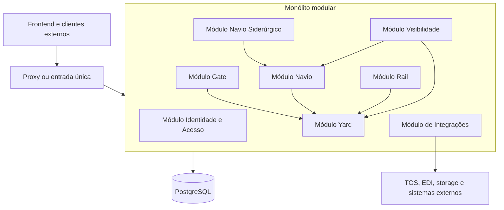

# Arquitetura do monólito modular CloudPort

## Status da decisão

- Estado: vigente
- Arquitetura alvo: monólito modular
- Primeiro corte implementado: Navio + Navio Siderúrgico
- Runtime atual do corte: `backend/cloudport-monolito-navio`

Este documento é a referência principal para decisões de estrutura, comunicação, dados, segurança, build e implantação do backend durante a migração.

## Decisão

O CloudPort deixará de evoluir como um conjunto de microsserviços internos independentes e será consolidado em um monólito modular.

O monólito modular deve possuir:

1. um artefato e um processo de aplicação para os módulos migrados;
2. módulos de domínio com responsabilidade e dependências explícitas;
3. comunicação local por interfaces, portas e eventos internos;
4. contratos HTTP preservados na borda para o frontend e integrações externas;
5. segurança, CORS, logs, métricas, tracing e tratamento de erros centralizados;
6. persistência compartilhada sem permitir acesso indiscriminado às tabelas de outro módulo;
7. migração incremental, com possibilidade de rollback até a retirada de cada deployment legado.

## O que muda

### Antes

- cada domínio podia possuir uma aplicação Spring Boot e um deployment próprios;
- chamadas internas usavam HTTP ou RabbitMQ mesmo quando pertenciam ao mesmo produto;
- configurações de segurança, CORS, observabilidade e banco eram repetidas;
- a operação dependia da disponibilidade e do roteamento entre vários processos.

### Depois

- funcionalidades internas passam a ser módulos de um runtime comum;
- chamadas entre módulos incorporados são locais;
- HTTP e mensageria ficam restritos à borda do sistema, integrações externas e período de transição;
- o frontend consome uma única origem de API;
- deploy, rollback e monitoramento são realizados por runtime consolidado.

## Estado atual

O primeiro runtime consolidado já reúne os artefatos Maven `servico-navio` e `servico-navio-siderurgico`.

| Capacidade | Estado atual |
| --- | --- |
| Processo Spring Boot único | Implementado para Navio + Navio Siderúrgico |
| Dependências entre módulos via Maven | Implementado |
| Comunicação siderúrgico -> cadastro canônico | Local por `CadastroNavioPorta` |
| Segurança | Centralizada no runtime consolidado |
| PostgreSQL | Uma conexão e dois schemas |
| Flyway | Um histórico independente por módulo |
| Teste com PostgreSQL real | Implementado com Testcontainers |
| Docker | Imagem própria do runtime consolidado |
| Roteamento de ambiente | Pendente |
| Retirada dos deployments antigos | Pendente |
| Yard, Gate, Rail, Autenticação e Visibilidade | Ainda executam como deployments legados |

## Visão de execução



O diagrama representa o estado alvo. No estado atual, somente Navio e Navio Siderúrgico estão dentro do runtime unificado.

## Limites dos módulos

Os nomes e diretórios existentes podem ser mantidos durante a transição, mas cada módulo deve seguir estas regras:

- possuir pacote raiz próprio;
- expor operações internas por interfaces públicas pequenas;
- não acessar controller, repository ou entidade interna de outro módulo diretamente;
- não depender de detalhes de infraestrutura de outro módulo;
- publicar eventos internos quando a dependência síncrona não for necessária;
- possuir suas próprias migrações e ser responsável pelas tabelas que cria;
- não introduzir dependência cíclica entre módulos.

### Módulos previstos

| Módulo | Responsabilidade principal |
| --- | --- |
| Identidade e Acesso | autenticação, emissão/validação de JWT, usuários, papéis e permissões |
| Gate | agendamentos, visitas de caminhão, transações e documentos de gate |
| Yard | mapa, posições, reservas, ordens, work queues e work instructions |
| Navio | cadastro canônico, visitas, itens operacionais, plano de estiva e eventos |
| Navio Siderúrgico | regras e projeções específicas para cargas siderúrgicas |
| Rail | visitas ferroviárias, composição, ordens e operações de ferrovia |
| Visibilidade | dashboards, histórico, alertas e projeções de leitura |
| Integrações | TOS, EDI, webhooks, storage, mensageria e adaptadores externos |

## Comunicação entre módulos

### Permitido

- chamada direta por porta/interface definida pelo módulo proprietário;
- evento interno publicado dentro do processo;
- DTO de contrato interno estável, sem expor entidade JPA;
- transação coordenada explicitamente quando a operação realmente for atômica.

### Transitório

- HTTP entre módulos que ainda estão em processos diferentes;
- `X-CloudPort-Service-Key` para autenticar deployments legados;
- RabbitMQ para atravessar a fronteira entre o runtime consolidado e processos ainda não migrados.

### Não permitido para código novo

- criar cliente HTTP entre dois módulos que já executam no mesmo runtime;
- consultar diretamente o schema de outro módulo para evitar uma API interna;
- compartilhar repository JPA entre módulos;
- criar um novo executável Spring Boot para uma funcionalidade interna sem decisão arquitetural registrada;
- duplicar autenticação, CORS ou tratamento global de erros dentro de módulos incorporados.

## Persistência e Flyway

A estratégia inicial usa uma conexão PostgreSQL e schemas separados por módulo. Isso reduz o risco da migração e mantém a propriedade dos dados explícita.

No primeiro corte:

- `cloudport_navio` pertence ao módulo Navio;
- `cloudport_siderurgico` pertence ao módulo Navio Siderúrgico;
- as migrações de Navio são publicadas em `classpath:cloudport/migrations/navio`;
- as migrações siderúrgicas são publicadas em `classpath:cloudport/migrations/navio-siderurgico`;
- o runtime executa dois objetos Flyway independentes antes da criação do `EntityManagerFactory`;
- o `search_path` inclui os dois schemas e `public`.

Regras:

1. cada tabela possui um módulo proprietário;
2. alterações de schema são feitas somente pelas migrações do módulo proprietário;
3. joins entre schemas não devem substituir contratos de módulo;
4. nomes de schema devem ser validados antes de serem usados na configuração;
5. a consolidação futura de schemas exige migração própria, plano de rollback e validação de dados.

## APIs e frontend

Os contratos REST públicos podem permanecer com as rotas atuais para evitar quebra do frontend e de integrações. A mudança de arquitetura interna não exige mudar a URL funcional de cada recurso.

O frontend deve:

- usar uma única `baseApiUrl`;
- não conhecer portas ou hosts específicos de módulos;
- não decidir se uma chamada será local ou remota no backend;
- receber erros no formato padronizado com `codigo`, `mensagem`, `detalhes`, `correlationId` e timestamp;
- gerar tipos a partir do OpenAPI consolidado quando essa etapa for implementada.

Durante a transição, um proxy pode encaminhar rotas ainda legadas. Após a incorporação de um módulo, o mesmo caminho deve apontar para o runtime monolítico sem exigir alteração na aplicação Angular.

## Segurança

O runtime consolidado é responsável por:

- validar JWT HS256 emitido pelo módulo de identidade enquanto o emissor permanecer separado;
- converter claims `roles` ou `role` para autoridades Spring Security;
- aplicar uma única política CORS;
- manter a aplicação stateless;
- liberar somente health, info, documentação da API e assets públicos;
- aplicar o filtro de credencial interna enquanto existirem deployments legados;
- exigir segredo JWT com no mínimo 32 bytes.

Quando Identidade e Acesso for incorporado, emissão e validação continuarão separadas por componentes internos, mesmo executando no mesmo processo.

## Observabilidade

Todos os módulos devem usar a infraestrutura central de observabilidade do runtime.

Campos mínimos de correlação:

- `correlationId`;
- módulo de origem;
- usuário ou cliente autenticado;
- visita, item, reserva, ordem, work queue ou equipamento quando aplicável;
- operação e resultado;
- duração e erro normalizado.

Métricas e tracing devem identificar o módulo lógico, sem depender do nome de um microsserviço ou do host de execução.

## Build e empacotamento

O corte atual é construído pelo reator `backend/cloudport-navio-modules`:

```text
cloudport-navio-modules
├── servico-navio
├── servico-navio-siderurgico
└── cloudport-monolito-navio
```

Os módulos de domínio produzem JARs de biblioteca no perfil `modulo-monolito`. O runtime declara esses artefatos como dependências e gera o único JAR executável.

O código do runtime não deve adicionar diretórios de fontes externos por plugin Maven. Recursos pertencentes a um módulo, inclusive migrações, devem ser publicados dentro do artefato desse módulo.

## Implantação

### Estado transitório

- o runtime consolidado pode coexistir com deployments antigos;
- somente um caminho de escrita deve estar ativo para cada domínio;
- jobs agendados duplicados devem ser desativados antes de executar os dois modelos em paralelo;
- o proxy deve direcionar cada rota para exatamente um backend;
- a mesma base PostgreSQL pode ser usada desde que schemas e históricos Flyway sejam compatíveis.

### Estado alvo

- um deployment do backend CloudPort;
- uma origem de API para o frontend;
- health check e métricas do runtime único;
- módulos internos sem descoberta de serviço;
- configurações centralizadas por ambiente;
- mensageria apenas quando houver necessidade de integração, desacoplamento temporal ou comunicação externa.

## Plano de migração

### Fase 1 - Navio e Navio Siderúrgico

Implementado no código. Falta concluir o corte de ambiente, o roteamento e a retirada segura dos deployments antigos.

### Fase 2 - Yard

- incorporar regras, APIs, repositórios e jobs do Yard;
- substituir chamadas HTTP Navio -> Yard por portas locais;
- manter os contratos REST externos;
- validar reservas, ordens, work queues, dispatch e reconciliação no mesmo runtime;
- impedir execução duplicada de jobs durante o corte.

### Fase 3 - Gate e Rail

- incorporar os dois módulos sem permitir dependência direta entre suas entidades;
- usar o módulo Yard por portas internas;
- preservar integrações externas de gate, OCR, TOS e ferrovia em adaptadores.

### Fase 4 - Identidade e Visibilidade

- incorporar autenticação, autorização e projeções de leitura;
- centralizar OpenAPI, tratamento de erros e observabilidade;
- remover a necessidade de credencial de serviço para chamadas internas.

### Fase 5 - Limpeza

- retirar deployments, imagens e configurações legadas;
- remover clientes HTTP internos que deixaram de ser necessários;
- renomear artefatos e diretórios somente quando não houver impacto operacional;
- consolidar parent Maven, versões e plugins;
- atualizar diagramas, runbooks e pipelines.

## Critérios para retirar um deployment legado

Um deployment somente pode ser removido quando:

1. todos os endpoints usados possuem paridade funcional;
2. autenticação e autorização foram validadas;
3. migrações e dados existentes são compatíveis;
4. jobs agendados executam uma única vez;
5. frontend e integrações externas foram testados;
6. logs, métricas, health checks e alertas estão disponíveis;
7. testes unitários, integração, contrato e e2e do fluxo crítico passaram;
8. o proxy aponta para o runtime consolidado;
9. existe procedimento de rollback testado;
10. não há conflito com a versão atual da `main`.

## Rollback

Enquanto os deployments legados existirem, o rollback deve preservar:

- compatibilidade das tabelas e históricos Flyway;
- possibilidade de redirecionar o proxy para o deployment anterior;
- variáveis de ambiente antigas documentadas;
- desativação do runtime substituído antes de reativar jobs legados;
- ausência de escrita concorrente pelos dois modelos.

Migrações destrutivas não devem ser aplicadas na mesma entrega que remove um deployment legado.

## Convenções para novas alterações

- tratar `cloudport-monolito-navio` como primeiro runtime de consolidação, não como arquitetura definitiva limitada ao domínio Navio;
- preferir nomes de módulo de negócio a nomes de infraestrutura;
- manter controllers na borda e regras em serviços de aplicação/domínio;
- usar portas para comunicação entre módulos;
- registrar no arquivo de requisitos qualquer acoplamento HTTP interno ainda não removido;
- atualizar esta documentação quando um módulo mudar de estado.
