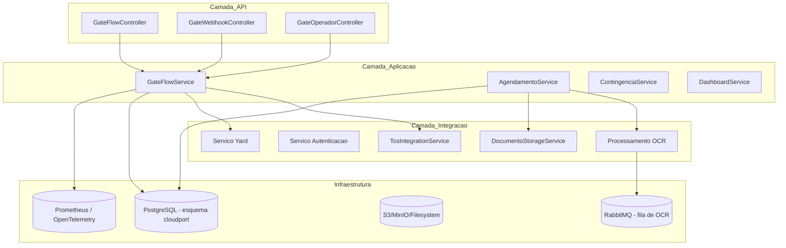

# Arquitetura do servico-gate

Este documento aprofunda a arquitetura lógica, física e operacional do microserviço **servico-gate**, responsável por controlar as operações de entrada e saída de contêineres nos gates do terminal.

## Visão lógica

### Componentes chave

- **GateFlowController**: expõe endpoints REST (`/gate/entrada`, `/gate/saida`) utilizados por operadores autenticados na aplicação.
- **GateWebhookController**: recebe eventos do middleware local do terminal (`/webhooks/gate/entrada`, `/webhooks/gate/saida`) e reutiliza o mesmo fluxo de negócio.
- **GateFlowService**: concentra as regras de negócio, consulta o TOS, valida documentos e registra eventos do gate.
- **AgendamentoService / DocumentoStorageService**: gerenciam agendamentos e documentação enviada pelos transportadores, incluindo disparo de OCR assíncrono.
- **Processamento OCR**: continua utilizando RabbitMQ apenas para orquestrar a fila de validação automática de documentos, sem qualquer interação direta com hardware de gate.
- **Clientes externos (TOS, Yard, Autenticação)**: abstrações REST que conectam o serviço às demais camadas da plataforma CloudPort.

## Fluxos de entrada e saída

### Evento de entrada enviado pelo middleware

1. O middleware instalado no terminal captura OCR/placa e envia `POST /webhooks/gate/entrada` com `GateFlowRequest`.
2. O `GateWebhookController` sanitiza os campos recebidos e encaminha para o `GateFlowService`.
3. O serviço valida o agendamento, consulta o TOS e registra o evento no banco.
4. A resposta retorna um `GateDecisionDTO` indicando se a cancela deve ser liberada ou mantida retida.

### Evento de saída enviado pelo middleware

1. O middleware local envia `POST /webhooks/gate/saida` com os mesmos campos do request de entrada.
2. O `GateFlowService` valida se houve entrada registrada, verifica a tolerância de horário e conclui o gate.
3. A resposta informa a decisão final e atualiza o status do agendamento.

### Ações realizadas pelo operador

1. Operadores autenticados podem acionar `POST /gate/entrada` ou `POST /gate/saida` através da interface web oficial.
2. Os endpoints reutilizam o mesmo `GateFlowService`, garantindo consistência com o fluxo vindo do middleware.
3. A aplicação registra eventos em tempo real para painéis operacionais e auditoria.

## Contratos de API

| Endpoint | Método | Descrição | Autenticação |
|----------|--------|-----------|--------------|
| `/gate/entrada` | POST | Processa evento de entrada informado por operador | Bearer Token (JWT) |
| `/gate/saida` | POST | Processa evento de saída informado por operador | Bearer Token (JWT) |
| `/gate/agendamentos/{id}/liberacao-manual` | POST | Registra bloqueio/liberação manual | Bearer Token |
| `/webhooks/gate/entrada` | POST | Recebe evento automático do middleware local do gate | Bearer Token (escopo `gate.middleware`) |
| `/webhooks/gate/saida` | POST | Recebe evento automático de saída do middleware local do gate | Bearer Token (escopo `gate.middleware`) |
| `/actuator/health` | GET | Health-check para orquestradores | Público |

Swagger UI: [http://localhost:8082/swagger-ui.html](http://localhost:8082/swagger-ui.html)

## Integrações externas

| Integração | Protocolo | Descrição | Variáveis |
|------------|-----------|-----------|-----------|
| Middleware local do gate | REST/Webhook | Sistema no terminal envia eventos de OCR/placa para os endpoints `/webhooks/gate/**` | `GATE_SECURITY_JWT_SECRET`, `GATE_SECURITY_CORS_ALLOWED_ORIGINS` |
| RabbitMQ (OCR) | AMQP 0-9-1 | Processamento assíncrono de validação de documentos via OCR | `GATE_RABBIT_*`, `cloudport.gate.ocr.*` |
| PostgreSQL | JDBC | Persistência de agendamentos, passes e eventos do gate | `GATE_DB_*` |
| TOS API | REST | Consulta de restrições, reservas de pátio e atualizações de manifestos | `TOS_API_*` |
| Storage de documentos | REST/S3 | Armazenamento de manifestos e fotos | `DOCUMENT_STORAGE_*` |
| Observabilidade | HTTP/OTLP | Exposição de métricas e traces | `OTEL_EXPORTER_OTLP_ENDPOINT` |

## Requisitos de implantação

- Configurar readiness/liveness probes no Kubernetes apontando para `/actuator/health`.
- Provisionar credenciais de serviço específicas para o middleware do gate, com escopo `gate.middleware` no provedor de identidade.
- Garantir HTTPS/TLS entre o middleware local e o `servico-gate`, utilizando autenticação mútua quando aplicável.
- Manter o broker RabbitMQ disponível apenas para o fluxo de OCR (fila `cloudport.gate.ocr.solicitacao-queue`).

## Gate de entrada/saída em modo contingência

Quando o `servico-gate` estiver indisponível, os operadores devem seguir o playbook descrito em [`docs/servico-gate-operacoes.md`](servico-gate-operacoes.md) para registrar operações manualmente e realizar posterior sincronização.
