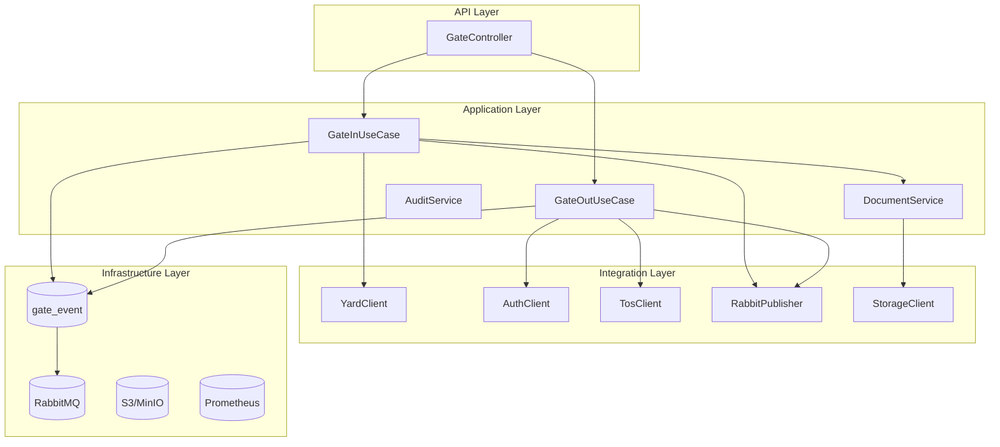

# Arquitetura do servico-gate

Este documento aprofunda a arquitetura lógica, física e operacional do microserviço **servico-gate**, responsável por controlar as operações de entrada e saída de contêineres nos gates do terminal.

## Visão lógica

### Componentes chave

- **GateController**: expõe endpoints REST (`/gate/in/**`, `/gate/out/**`) e realiza validações iniciais.
- **GateInUseCase / GateOutUseCase**: coordenam regras de negócio (verificações de documentos, liberação de cancelas, auditoria).
- **RabbitPublisher**: publica eventos `gate.in.confirmed` e `gate.out.confirmed` nas filas configuradas.
- **StorageClient**: abstrai operações de upload/download em MinIO, S3 ou storage local.
- **TosClient / YardClient / AuthClient**: clientes declarativos para integrar com outros microsserviços do TOS.

## Gate-in e Gate-out (gate-in/out)

### Gate-in (entrada)

1. O transportador envia `POST /gate/in/check-in` com dados do contêiner e manifestos.
2. O `GateInUseCase` consulta o `servico-yard` para validar a presença do contêiner.
3. Documentos são armazenados no provedor configurado (`DOCUMENT_STORAGE_PROVIDER`).
4. Um evento `gate.in.confirmed` é publicado em `GATE_EVENT_EXCHANGE` e a mensagem entra na fila `GATE_INBOUND_QUEUE`.
5. A resposta síncrona devolve o protocolo de entrada e o SLA estimado para liberação de pátio.

### Gate-out (saída)

1. O transportador envia `POST /gate/out/validate` com o protocolo de saída.
2. O `GateOutUseCase` consulta permissões com o `servico-autenticacao` e verifica restrições pendentes via TOS.
3. Caso aprovado, um evento `gate.out.confirmed` é publicado em `GATE_EVENT_EXCHANGE`, roteando para `GATE_OUTBOUND_QUEUE`.
4. A mensagem aciona a liberação da cancela e dispara auditoria para o data lake.

## Contratos de API

| Endpoint | Método | Descrição | Autenticação |
|----------|--------|-----------|--------------|
| `/gate/in/check-in` | POST | Registra chegada do veículo e anexa documentos | Bearer Token (JWT) |
| `/gate/in/{id}/status` | GET | Consulta status de processamento do protocolo de entrada | Bearer Token |
| `/gate/out/validate` | POST | Valida autorização para saída do contêiner | Bearer Token |
| `/gate/out/{id}/confirm` | POST | Confirma conclusão do gate-out | Bearer Token |
| `/health` | GET | Endpoint de health-check para orquestradores | Público |

Swagger UI: [http://localhost:8082/swagger-ui.html](http://localhost:8082/swagger-ui.html)

## Integrações externas

| Integração | Protocolo | Descrição | Variáveis |
|------------|-----------|-----------|-----------|
| RabbitMQ | AMQP 0-9-1 | Publicação de eventos gate-in/out e notificações de auditoria | `GATE_RABBIT_*`, `GATE_EVENT_EXCHANGE`, `GATE_INBOUND_QUEUE`, `GATE_OUTBOUND_QUEUE` |
| PostgreSQL | JDBC | Persistência de protocolos, auditorias e logs operacionais | `GATE_DB_*` |
| TOS API | REST | Consulta de restrições, reservas de pátio e atualizações de manifestos | `TOS_API_*` |
| Storage de documentos | REST/S3 | Armazenamento de manifestos e fotos | `DOCUMENT_STORAGE_*` |
| Observabilidade | HTTP/OTLP | Exposição de métricas e traces | `GATE_METRICS_ENDPOINT`, `OTEL_EXPORTER_OTLP_ENDPOINT` |

## Requisitos de implantação

- Configurar readiness/liveness probes no Kubernetes apontando para `/actuator/health`.
- Garantir políticas de retry e DLQ configuradas na broker para filas `gate.in.dead-letter` e `gate.out.dead-letter` (vide manifesto K8s).
- Habilitar autoscaling baseado em consumo de CPU (>60%) e backlog de mensagens.

## Gate de entrada/saída em modo contingência

Quando o `servico-gate` estiver indisponível, os operadores devem seguir o playbook descrito em [`docs/servico-gate-operacoes.md`](servico-gate-operacoes.md) para registrar operações manualmente e realizar posterior sincronização.
